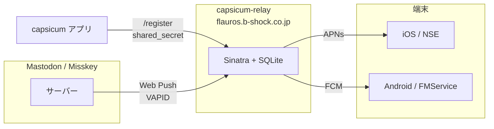
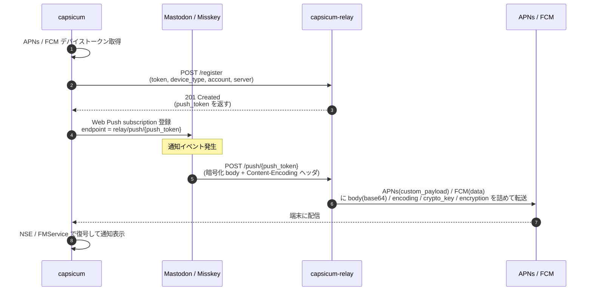
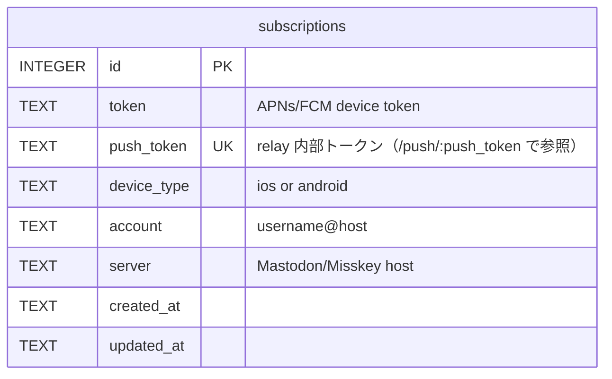

# capsicum-relay 開発ガイド

## プロジェクト概要

capsicum（Mastodon / Misskey クライアント）向けのプッシュ通知リレーサーバー。
Mastodon / Misskey が送出する Web Push を受信し、APNs（iOS）/ FCM（Android）に変換して転送する。

- **技術スタック**: Ruby / Sinatra / Puma / SQLite
- **ホスティング**: Linode Nanode（Ubuntu 24.04 LTS）
- **リポジトリ**: <https://github.com/pooza/capsicum-relay>
- **本番稼働**: 2026-04（capsicum v1.18 と同時リリース）以降、プリセットサーバー向けに稼働中

## アーキテクチャ



- Web Push の暗号化ペイロードは復号**しない**。Base64 のまま `custom_payload` / `data` に詰め、クライアント側（iOS は NSE / Android は `FirebaseMessagingService`）で復号して表示する（B 案採用）。[capsicum#336](https://github.com/pooza/capsicum/issues/336) 参照
- リレーが秘密鍵を持たないことで、将来の外部ユーザー向け有償提供時も E2E 前提を維持できる

### エンドポイント

| メソッド | パス | 認証 | 用途 |
|---------|------|------|------|
| GET | `/health` | なし | ヘルスチェック |
| POST | `/register` | X-Relay-Secret | デバイストークン登録（capsicum → リレー） |
| DELETE | `/register/:id` | X-Relay-Secret | 登録解除 |
| POST | `/push/:push_token` | なし（トークンの推測困難性で保護） | Web Push 受信（Mastodon / Misskey → リレー） |

### 通信フロー



### ライフサイクル異常時の挙動

| 状況 | 応答 | 意図 |
|------|------|------|
| `/push/:push_token` で未知のトークン | 410 Gone | Mastodon 側の subscription を自動 destroy させる（404 だと残り続けるため） |
| APNs が `BadDeviceToken` / `Unregistered` / `DeviceTokenNotForTopic` を返した | 410 Gone + DB 行削除 | device token 無効化。Mastodon に cleanup を促しつつ relay 側も掃除 |
| FCM が `UNREGISTERED` / `SENDER_ID_MISMATCH` を返した | 同上 | 同上。`INVALID_ARGUMENT` は request 側バグでも出るため誤削除回避に含めない |

### APNs / FCM 転送ペイロードのスキーマ

`/push/:push_token` で受けた Web Push を APNs (`custom_payload`) / FCM (`data`) の同形フィールドに詰めて転送する。capsicum の NSE (iOS) / FirebaseMessagingService (Android) はこのスキーマに従って復号する。

| キー | 型 | 出現 | 内容 |
|------|-----|------|------|
| `body` | string (base64) | 常時 | Web Push の生 body（暗号化済）。`strict_encode64` で URL-safe でない通常の base64 |
| `encoding` | string | 常時 | `Content-Encoding` ヘッダ値（`aes128gcm` or `aesgcm`）。空文字なら非暗号化（通常はあり得ない） |
| `server` | string | 常時 | 登録時の `server`（Mastodon/Misskey ホスト名） |
| `account` | string | 常時 | 登録時の `account`（`username@host` 形式） |
| `crypto_key` | string | `aesgcm` のとき | `Crypto-Key` ヘッダ原文。`dh=...;p256ecdsa=...` などキー付きの値 |
| `encryption` | string | `aesgcm` のとき | `Encryption` ヘッダ原文。`salt=...` を含む |

#### 復号の実装上の注意

- **aes128gcm (RFC 8291)**: body 先頭に `salt` (16 byte) / `rs` (4 byte) / `idlen` (1 byte) / sender public key が前置されているため、body のみで復号可能。Mastodon 4.x / 現行 Misskey はこちら
- **aesgcm (legacy RFC 8188 draft 03)**: salt は `Encryption` ヘッダ、sender public key は `Crypto-Key` ヘッダの `dh=` パラメータに入っているため、これらも参照しないと復号できない。古い Mastodon フォーク / 一部 Misskey で使用される可能性あり
- **VAPID ヘッダ**: capsicum-relay は VAPID `Authorization` ヘッダを転送しない（push service 側で consume するもので、クライアント復号には不要）
- **TTL / Topic / Urgency**: Web Push 仕様のヘッダは転送しない（通知表示の用途なし）

## データモデル（SQLite）

`subscriptions` テーブルは `(token, account, server)` 複合ユニーク。同一端末に複数アカウントを登録した場合、各アカウントに独立した行と `push_token` が割り当てられる（1 デバイス N アカウント対応、[#3](https://github.com/pooza/capsicum-relay/issues/3) で実装）。



`UNIQUE(token, account, server)` + `UNIQUE(push_token)`。`push_token` は `SecureRandom.hex(32)`（64 文字 hex）。旧スキーマ（`UNIQUE(token)`）からの移行は起動時に自動で走る。

## コーディング規約

### RuboCop

モロヘイヤ由来の `.rubocop.yml` を適用。`bundle exec rubocop` がクリーンであることを PR マージの最低条件とする。

### RuboCop に含まれない個人規約

以下はユーザーから都度指示される。指示があり次第ここに追記する。

- メソッド末尾でも `return` を省略しない（暗黙のreturnを使わない）。ただし初期化・マイグレーション等の「戻り値が意味を持たない副作用専用メソッド」は除く（モロヘイヤと同じ運用）
- インデントは常に2スペース。見栄えのための位置揃え（代入の右辺にcase/if式を置いて深くインデントする等）は使わない。`x = case ...` ではなく、各分岐内で個別に代入する
- Sinatra の `configure do` / `helpers do` はメソッド定義を束ねるブロックであり、行数で括らない。`Metrics/BlockLength` の `AllowedMethods` に追加してある
- Sinatra の route ブロック（`get '/xxx' do ... end`）の最終値は暗黙 return のままにする。`return` はブロック内でエンクロージングメソッドからの return になるため使わない。途中離脱は `halt` を使う

## インフラ

| 項目 | 値 |
|------|-----|
| ホスト名 | flauros.b-shock.co.jp |
| 公開ドメイン | relay.capsicum.shrieker.net |
| OS | Ubuntu 24.04 LTS |
| スペック | 1 vCPU / 1GB RAM / 25GB SSD |
| SSH | `deploy@flauros.b-shock.co.jp` |
| デプロイパス | `/home/deploy/repos/capsicum-relay` |
| Ruby | rbenv 管理 |
| プロセス管理 | systemd (`capsicum-relay.service`) |
| リバースプロキシ | nginx（HTTPS 終端、Let's Encrypt 自動更新） |
| Puma | `127.0.0.1:9292`（nginx 背後） |

### デプロイ手順

```bash
ssh deploy@flauros.b-shock.co.jp
cd ~/repos/capsicum-relay
git pull
bundle install
sudo systemctl restart capsicum-relay
```

### 疎通確認

```bash
curl https://relay.capsicum.shrieker.net/health
# => {"status":"ok","subscriptions":N}
```

## ディレクトリ構成

```text
capsicum-relay/
  docs/               # 開発ドキュメント
    CLAUDE.md          # 本ファイル
  app.rb               # Sinatra アプリ本体
  config.ru            # Rack エントリポイント
  lib/
    relay/
      database.rb      # SQLite ラッパー（自動マイグレーション）
      apns_client.rb   # APNs HTTP/2 クライアント（apnotic gem）
      fcm_client.rb    # FCM v1 API クライアント（googleauth gem）
  config/
    settings.yml.sample    # 設定ファイルテンプレート
    puma.rb                # Puma 設定
    capsicum-relay.service # systemd ユニットファイル
    nginx.conf.sample      # nginx 設定テンプレート
  db/                  # SQLite データベース格納先
  Gemfile              # 依存 gem
```

## 設定

`config/settings.yml.sample` をコピーして `config/settings.yml` を作成する。
APNs / FCM のクレデンシャルは `.gitignore` で除外されている。

### 必要なクレデンシャル

| 項目 | 用途 | 配置先 |
|------|------|--------|
| APNs 認証キー（.p8） | iOS プッシュ通知送信 | settings.yml の `apns.key_path` |
| APNs Key ID | 同上 | settings.yml の `apns.key_id` |
| APNs Team ID | 同上 | settings.yml の `apns.team_id` |
| Firebase サービスアカウント JSON | Android プッシュ通知送信 | settings.yml の `fcm.service_account_path` |
| shared_secret | capsicum からの登録認証 | settings.yml の `shared_secret` |

## 関連リポジトリ

| リポジトリ | 関係 |
|-----------|------|
| [capsicum](https://github.com/pooza/capsicum) | クライアント本体。リレーにデバイストークンを登録し、通知を受信する |
| [mulukhiya-toot-proxy](https://github.com/pooza/mulukhiya-toot-proxy) | モロヘイヤ。Ruby の運用知見・コーディング規約の共有元 |

## 関連 Issue

- [capsicum#52](https://github.com/pooza/capsicum/issues/52) — プッシュ通知リレー（本体 Issue、Stage 1 完了済み）
- [capsicum#314](https://github.com/pooza/capsicum/issues/314) — iOS APNs デバイストークン取得（完了）
- [capsicum#336](https://github.com/pooza/capsicum/issues/336) — プッシュ通知ペイロードの復号と通知内容の個別表示（Phase 1: 復号器、Phase 2: FCM 復号 + ローカル通知表示まで完了）
- [capsicum#355](https://github.com/pooza/capsicum/issues/355) — Misskey プッシュ登録を relay 経由にルーティング（Stage 2）
- [capsicum-relay#2](https://github.com/pooza/capsicum-relay/issues/2) — 可視性の強化（構造化ログ / メトリクス）
- [capsicum-relay#5](https://github.com/pooza/capsicum-relay/issues/5) — 受信時の `Content-Encoding` をログ出力

## 段階的リリース計画

詳細は capsicum の [push-relay-plan.md](https://github.com/pooza/capsicum/blob/develop/docs/push-relay-plan.md) を参照。

- **Stage 1**: Mastodon プッシュ通知（プリセットサーバー向け）— capsicum v1.18 で出荷済み
- **Stage 2**: Misskey プッシュ通知 — Phase 1（aesgcm 互換ヘッダ転送 / 復号器）完了、Phase 2（FCM 復号 + フォアグラウンド通知）完了。残タスクは capsicum#336 側にある
- **Stage 3**: 外部ユーザー向け有償提供 — 外部ユーザーの規模が確認されてから具体化。relay 側で課金ロジック・認可・サブスク管理が必要になる想定

## 現在の状態（2026-04-23）

capsicum v1.19.1 をもって、relay は iOS / Android いずれのプリセットサーバー向けにも本番稼働している。v1.20（プッシュ通知完成）で relay 側の観測性・運用性向上を進める。

### 完了済み

- [x] リポジトリ作成・雛形実装
- [x] flauros デプロイ・systemd 登録
- [x] nginx + Let's Encrypt 証明書（自動更新有効）
- [x] APNs クレデンシャル配置・本番動作確認
- [x] FCM クレデンシャル配置・本番動作確認
- [x] shared_secret 本番値設定
- [x] capsicum との結合テスト（Mastodon / Misskey 両方）
- [x] subscription-scoped スキーマ（1 デバイス N アカウント、[#3](https://github.com/pooza/capsicum-relay/issues/3)）
- [x] device token 無効化時の 410 Gone 応答（[#1](https://github.com/pooza/capsicum-relay/issues/1)）
- [x] aesgcm レガシー対応（Crypto-Key / Encryption ヘッダ転送、capsicum#336 Phase 1）
- [x] account の host 二重付与バグ修正（[#4](https://github.com/pooza/capsicum-relay/issues/4)）
- [x] RuboCop 適用・規約統一（モロヘイヤ規約ベース）

### v1.20 で進めるもの

- [ ] 構造化ログ / メトリクス / 失敗可視化（[#2](https://github.com/pooza/capsicum-relay/issues/2)）
- [ ] `/push/:push_token` 受信時の `Content-Encoding` をログ出力（[#5](https://github.com/pooza/capsicum-relay/issues/5)）
