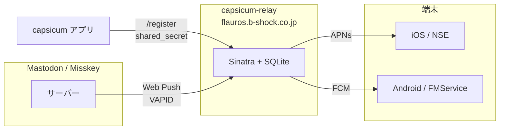
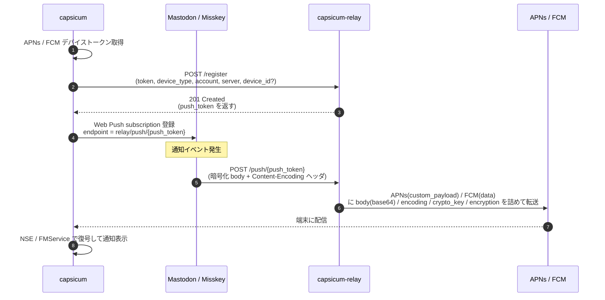
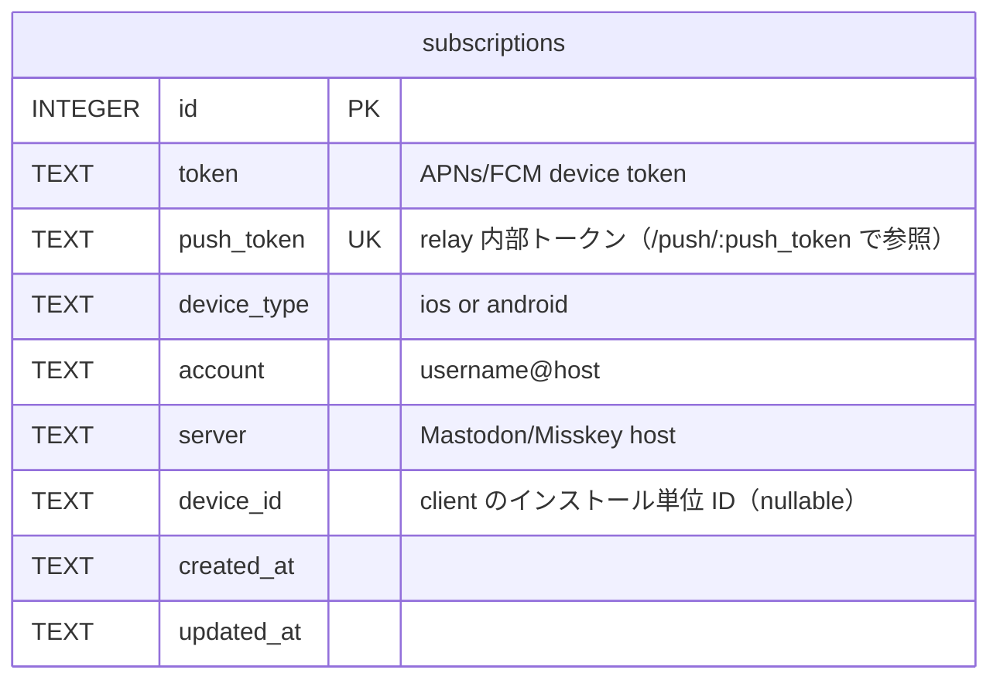
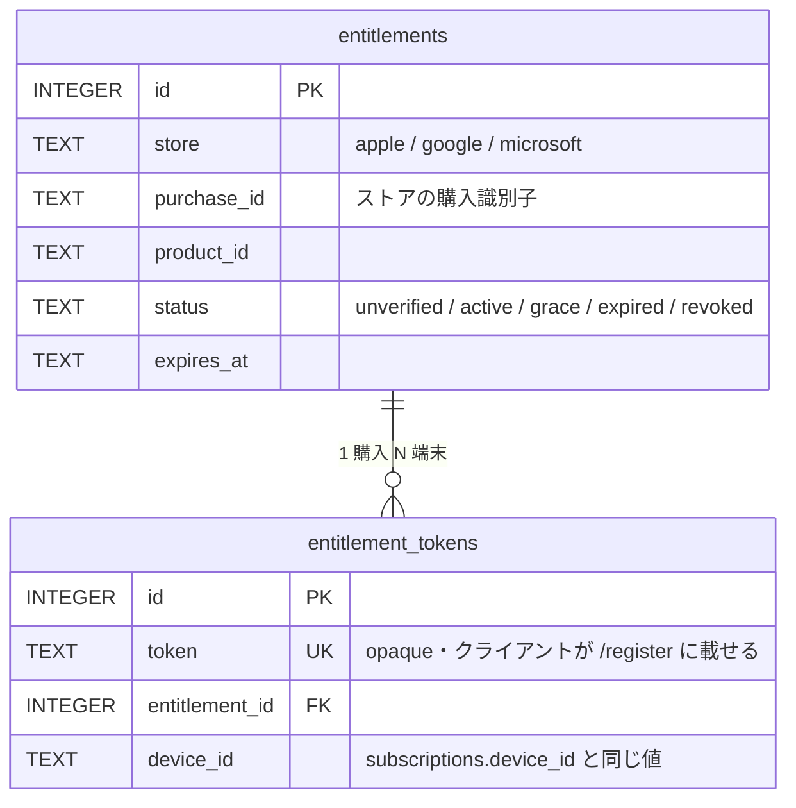

# capsicum-relay 開発ガイド

## プロジェクト概要

capsicum（Mastodon / Misskey クライアント）向けのプッシュ通知リレーサーバー。
Mastodon / Misskey が送出する Web Push を受信し、APNs（iOS）/ FCM（Android）に変換して転送する。

- **技術スタック**: Ruby / Sinatra / Puma / SQLite
- **ホスティング**: Linode Nanode（Ubuntu 24.04 LTS）
- **リポジトリ**: <https://github.com/pooza/capsicum-relay>
- **本番稼働**: 2026-04（capsicum v1.18 と同時リリース）以降、プリセットサーバー向けに稼働中

## アーキテクチャ


```mermaid
flowchart LR
  subgraph sns[Mastodon / Misskey]
    srv[サーバー]
  end
  subgraph relay[capsicum-relay<br/>flauros.b-shock.co.jp]
    app[Sinatra + SQLite]
  end
  subgraph device[端末]
    ios[iOS / NSE]
    android[Android / FMService]
  end
  client[capsicum アプリ] -- /register<br/>shared_secret --> app
  srv -- Web Push<br/>VAPID --> app
  app -- APNs --> ios
  app -- FCM --> android
```

- Web Push の暗号化ペイロードは復号**しない**。Base64 のまま `custom_payload` / `data` に詰め、クライアント側（iOS は NSE / Android は `FirebaseMessagingService`）で復号して表示する（B 案採用）。[capsicum#336](https://github.com/pooza/capsicum/issues/336) 参照
- リレーが秘密鍵を持たないことで、将来の外部ユーザー向け有償提供時も E2E 前提を維持できる

### エンドポイント

| メソッド | パス | 認証 | 用途 |
|---------|------|------|------|
| GET | `/health` | なし | ヘルスチェック |
| POST | `/register` | X-Relay-Secret | デバイストークン登録（capsicum → リレー） |
| DELETE | `/register/:id` | X-Relay-Secret | 登録解除 |
| POST | `/push/:push_token` | なし（トークンの推測困難性で保護） | Web Push 受信（Mastodon / Misskey → リレー） |
| POST | `/entitlements` | X-Relay-Secret | 有償リレーの利用権の発行（capsicum#597 / [#58](https://github.com/pooza/capsicum-relay/issues/58)） |

### 通信フロー


```mermaid
sequenceDiagram
  autonumber
  participant C as capsicum
  participant S as Mastodon / Misskey
  participant R as capsicum-relay
  participant P as APNs / FCM
  C->>C: APNs / FCM デバイストークン取得
  C->>R: POST /register<br/>(token, device_type, account, server, device_id?)
  R-->>C: 201 Created<br/>(push_token を返す)
  C->>S: Web Push subscription 登録<br/>endpoint = relay/push/{push_token}
  Note over S: 通知イベント発生
  S->>R: POST /push/{push_token}<br/>(暗号化 body + Content-Encoding ヘッダ)
  R->>P: APNs(custom_payload) / FCM(data)<br/>に body(base64) / encoding / crypto_key / encryption を詰めて転送
  P-->>C: 端末に配信
  C->>C: NSE / FMService で復号して通知表示
```

### ライフサイクル異常時の挙動

| 状況 | 応答 | 意図 |
|------|------|------|
| `/push/:push_token` で未知のトークン | 410 Gone | Mastodon 側の subscription を自動 destroy させる（404 だと残り続けるため） |
| APNs が `BadDeviceToken` / `Unregistered` / `DeviceTokenNotForTopic` を返した | 410 Gone + DB 行削除 | device token 無効化。Mastodon に cleanup を促しつつ relay 側も掃除 |
| FCM が `UNREGISTERED` / `SENDER_ID_MISMATCH` を返した | 同上 | 同上。`INVALID_ARGUMENT` は request 側バグでも出るため誤削除回避に含めない |

### APNs / FCM 転送ペイロードのスキーマ

`/push/:push_token` で受けた Web Push を APNs (`custom_payload`) / FCM (`data`) の同形フィールドに詰めて転送する。capsicum の NSE (iOS) / FirebaseMessagingService (Android) はこのスキーマに従って復号する。

| キー | 型 | 出現 | 内容 |
|------|-----|------|------|
| `body` | string (base64) | 常時 | Web Push の生 body（暗号化済）。`strict_encode64` で URL-safe でない通常の base64 |
| `encoding` | string | 常時 | `Content-Encoding` ヘッダ値（`aes128gcm` or `aesgcm`）。空文字なら非暗号化（通常はあり得ない） |
| `server` | string | 常時 | 登録時の `server`（Mastodon/Misskey ホスト名） |
| `account` | string | 常時 | 登録時の `account`（`username@host` 形式） |
| `crypto_key` | string | `aesgcm` のとき | `Crypto-Key` ヘッダ原文。`dh=...;p256ecdsa=...` などキー付きの値 |
| `encryption` | string | `aesgcm` のとき | `Encryption` ヘッダ原文。`salt=...` を含む |

#### 復号の実装上の注意

- **aes128gcm (RFC 8291)**: body 先頭に `salt` (16 byte) / `rs` (4 byte) / `idlen` (1 byte) / sender public key が前置されているため、body のみで復号可能。Mastodon 4.x / 現行 Misskey はこちら
- **aesgcm (legacy RFC 8188 draft 03)**: salt は `Encryption` ヘッダ、sender public key は `Crypto-Key` ヘッダの `dh=` パラメータに入っているため、これらも参照しないと復号できない。古い Mastodon フォーク / 一部 Misskey で使用される可能性あり
- **VAPID ヘッダ**: capsicum-relay は VAPID `Authorization` ヘッダを転送しない（push service 側で consume するもので、クライアント復号には不要）
- **TTL / Topic / Urgency**: Web Push 仕様のヘッダは転送しない（通知表示の用途なし）

## データモデル（SQLite）

`subscriptions` テーブルは `(token, account, server)` 複合ユニーク。同一端末に複数アカウントを登録した場合、各アカウントに独立した行と `push_token` が割り当てられる（1 デバイス N アカウント対応、[#3](https://github.com/pooza/capsicum-relay/issues/3) で実装）。


```mermaid
erDiagram
  subscriptions {
    INTEGER id PK
    TEXT token "APNs/FCM device token"
    TEXT push_token UK "relay 内部トークン（/push/:push_token で参照）"
    TEXT device_type "ios or android"
    TEXT account "username@host"
    TEXT server "Mastodon/Misskey host"
    TEXT device_id "client のインストール単位 ID（nullable）"
    TEXT created_at
    TEXT updated_at
  }
```

`UNIQUE(token, account, server)` + `UNIQUE(push_token)`。`push_token` は `SecureRandom.hex(32)`（64 文字 hex）。旧スキーマ（`UNIQUE(token)`）からの移行は起動時に自動で走る。

### device_id による dedup（[#15](https://github.com/pooza/capsicum-relay/issues/15)）

`UNIQUE(token, account, server)` だけだと、**デバイスの push トークンが更新されたとき衝突せずに新しい行ができ、旧行が孤児として残る**。旧トークンがまだ生きていて上流が両方に送る間は同一デバイスに二重 push が届き、時間とともに悪化する。

`(account, server, device_type)` に潰す案は採れない。実データに iPhone + iPad のように**全アカウントで 2 トークンを一貫保持して両方更新し続けている運用**があり、潰すと最後に登録した端末しか通知を受け取れなくなる。

そこで client が[インストール単位の安定 ID](https://github.com/pooza/capsicum/issues/932)（乱数 UUID・`shared_preferences` 保存）を `device_id` として送り、relay はそれをキーに upsert する。

- **列は nullable**。`device_id` を送らない旧クライアントは従来どおり `token` をキーに動く
- 実質的な `UNIQUE(account, server, device_id)` は**部分インデックス** `idx_subscriptions_device ... WHERE device_id IS NOT NULL` で張る（SQLite はテーブル制約に `WHERE` を書けない）
- 既存行は移行時に埋められないので `NULL` のまま。**次回 register で埋まる**のを待つ

`device_id` 付き register がどの行を上書きするかは順序に意味がある。

1. **今のトークンを持つ行**があればそれ。上流が現に push している行なので、`push_token` を保ったまま `device_id` を埋める。トークンを書き換えないので `UNIQUE(token, account, server)` に触れない。旧クライアントからの移行はここを通る
2. 無ければ**同じ `device_id` の行**。これがトークン更新のケースで、行を増やさず `token` だけ差し替える
3. どちらも無ければ新規 INSERT

1 と 2 が別の行を指すのは、トークンが一度離れて戻る場合だけで実運用では起きない。起きたときは部分インデックス違反になるため、古い方（2 の行）を畳んで 1 を残す。畳んだ行の `announcement_subscriptions` は FK の CASCADE で消える点に注意。

## 有償リレーの利用権（capsicum#597・フェーズ 1）

⚠⚠ **現状は誰も拒まない。**`/register` も `/push` も従来どおり通る。ゲートは
[#60](https://github.com/pooza/capsicum-relay/issues/60)（フェーズ 2）、レシート検証は
[#61](https://github.com/pooza/capsicum-relay/issues/61) / [#62](https://github.com/pooza/capsicum-relay/issues/62)（フェーズ 3）。
正本は capsicum の [`docs/paid-relay-plan.md`](https://github.com/pooza/capsicum/blob/develop/docs/paid-relay-plan.md)。


```mermaid
erDiagram
  entitlements ||--o{ entitlement_tokens : "1 購入 N 端末"
  entitlements {
    INTEGER id PK
    TEXT store "apple / google / microsoft"
    TEXT purchase_id "ストアの購入識別子"
    TEXT product_id
    TEXT status "unverified / active / grace / expired / revoked"
    TEXT expires_at
  }
  entitlement_tokens {
    INTEGER id PK
    TEXT token UK "opaque・クライアントが /register に載せる"
    INTEGER entitlement_id FK
    TEXT device_id "subscriptions.device_id と同じ値"
  }
```

### ⚠⚠ `unverified` を許可側に入れない

`POST /entitlements` の認証は共有シークレット 1 本で、**そのシークレットはバイナリから取り出せる**（[capsicum#1121](https://github.com/pooza/capsicum/issues/1121)）。つまりこのエンドポイントは実質的に開いており、**誰でも好きな `purchase_id` で `unverified` の行を作れる**。フェーズ 3 でレシートを検証して初めて `active` になる。

### ⚠ 判定は `subscriptions.device_id` から引く

```text
/push/{push_token} → subscriptions（push_token UNIQUE）
                   → subscriptions.device_id
                   → entitlement_tokens（device_id）
                   → entitlements.status
```

クライアントが `/register` に載せてくる `entitlement_token` は**観測のため**に記録するだけで、判定には使わない。⚠ **`device_id` が NULL の行（旧クライアント）は利用権を引けない。**

### ⚠ `subscriptions` に列を足さない

あのテーブルは CHECK / UNIQUE を変えるたびに `rebuild_subscriptions_table!` が要り、**その組み替えは過去に子テーブルの FK を壊している**（`repair_announcement_subscriptions_fk!` が今も居座っているのがその跡・[capsicum#468](https://github.com/pooza/capsicum/issues/468)）。**課金の都合で push の中核テーブルを組み替えない。**

### ⚠ `status` に CHECK を付けない

[#63](https://github.com/pooza/capsicum-relay/issues/63) で扱う状態（更新・失効・返金・支払い猶予・課金リトライ）は**これから増える**。CHECK にすると状態を 1 つ足すたびにテーブル組み替えになり、`subscriptions` で踏んだ罠を新しいテーブルで再現する。検査は `Relay::Database::ENTITLEMENT_STATUSES` で行う。

### プリセット判定の写し

`lib/relay/preset_servers.rb` は capsicum の `packages/capsicum/lib/src/preset_servers.dart` の**写し**。⚠⚠ **2 箇所に同じ一覧がある。**

- ⚠ **クライアントに判定させられない。**ゲートは「非プリセット かつ 利用権なし」で閉じるので、申告に委ねると書き換えるだけで抜けられる
- ⚠⚠ **ズレると、載っていないプリセットサーバーの利用者がフェーズ 3 で止まる。**`test/preset_servers_test.rb` が件数を固定しているので、片方だけ増やすとテストが落ちる
- 設定の `extra_preset_hosts` は**足すことしかできない**（置き換えにすると、設定を書き忘れたデプロイで全登録が非プリセット扱いになる）

### 認可ゲート（[#60](https://github.com/pooza/capsicum-relay/issues/60)・フェーズ 2）

⚠⚠ **既定では何も閉じない。**`RELAY_ENTITLEMENT_ENFORCE=true` を立てたときだけ判定する。**本番で立てるのはフェーズ 3 の決定**で、⚠ **立てる前に下の観測を読み直すこと**。

判定は `Relay::EntitlementGate.decide` の 1 か所で、`/register` と `/push` の両方が通る。⚠ **2 か所に書くと片方だけ閉じる**（登録は拒むのに既存の購読は叩き続ける）。

| 順 | 条件 | 結果 |
| --- | --- | --- |
| 1 | `RELAY_ENTITLEMENT_ENFORCE` が `true` でない | allow（`enforce_off`） |
| 2 | プリセットホストで、**名乗りの裏が取れた** | allow（`preset`） |
| 2' | プリセットホストだが**鍵が引けなかった** | ⚠⚠ allow（`preset_unverifiable`）＝ fail-open |
| 2'' | プリセットホストだが**署名が無い / 鍵が違う** | ⚠ **プリセット扱いをやめて 3 へ** |
| 3 | その端末に `active` / `grace` の利用権がある | allow（`entitled`） |
| 4 | それ以外 | **deny**（`no_entitlement` / `preset_unsigned` / `preset_mismatch`） |
| — | 判定中に例外 | ⚠⚠ **allow**（`error`）＝ fail-open |

### プリセットの名乗りの裏取り（[#69](https://github.com/pooza/capsicum-relay/issues/69)）

⚠⚠ **`subscriptions.server` はクライアントの申告で、それ自体は証拠にならない。**共有シークレットは authorization boundary にできない（[capsicum#1121](https://github.com/pooza/capsicum/issues/1121)）ので、**誰でも `server: "mstdn.b-shock.org"` と名乗れる。**

→ **`/push` を叩くのは fedi サーバー自身**なので、**VAPID の署名だけは本物かどうかを確かめられる**。

```text
Authorization: vapid t=<JWT(ES256)>,k=<公開鍵>      ← 標準（RFC 8292）
Authorization: WebPush <JWT>  +  Crypto-Key: …;p256ecdsa=<公開鍵>   ← ⚠ 旧形式
                 ↓ 署名を検証（Relay::VapidAssertion）
                 ↓ そのホストの鍵と突き合わせる（Relay::VapidKeyDirectory）
```

- **鍵の取得元**（2026-09-28 に 9 ホストで実測）: Mastodon は `GET /api/v2/instance` の `configuration.vapid.public_key`、Misskey は `POST /api/meta` の `swPublickey`
- ⚠⚠ **引くのは一覧のホストだけ。**申告をそのまま取りに行くと **relay が SSRF の道具になる**
- ⚠⚠ **`aud`（宛先）まで見る。**鍵の照合だけでは足りない —— 攻撃者が**プリセットサーバーで自分のサーバー宛ての購読を作れば、本物の鍵で署名された `Authorization` を受け取れる**ので、それを期限内に貼り直せば通ってしまう
- 🔴 **期待値は設定（`relay_audience`）からしか取らない。リクエストのヘッダから組まない。**Rack の `request.host` は **`X-Forwarded-Host` を見る**うえ、`config/nginx.conf.sample` はそのヘッダを**消していない**。組んでいた版では、攻撃者が自分宛ての本物の署名に `X-Forwarded-Host` を添えるだけで**期待値ごと攻撃者の値になり、照合が素通りした**。⚠ **未設定なら「判定できない」に倒す**（`outcome="audience_unconfigured"` で fail-open）—— 勝手に組んで「検査したつもり」になるほうが危ない。⚠⚠ **デプロイ時に settings.yml へ書くこと**
- ⚠⚠ **鍵が合わなかったら、詐称と決める前に 1 度だけ引き直す。**プリセットサーバーが VAPID を作り直すと TTL のあいだ手元は古い鍵のままで、**本物の push が全部 mismatch になり、閉じていれば 410 で上流の購読が永久に消える**。⚠ 引き直しは **60 秒に 1 回まで**（合わない鍵で叩き続けるだけで DoS の踏み台になる）。⚠ **引き直せなかったら fail-open**
- ⚠ **metrics のラベルは正規化した host。**`subscriptions.server` は生の申告なので、大小・末尾のドット・空白の変種の数だけ系列が増える
- ⚠⚠ **旧形式（`WebPush` + `Crypto-Key`）を落とさない。**Mastodon は `standard` が false の購読へ旧形式で送るので、落とすと**本物のプリセットが詐称扱いになる**
- ⚠ **「鍵が引けない」と「署名が無い / 違う」を同じ倒し方にしない。**前者は**こちらの障害**なので fail-open、後者は**プリセット扱いをやめる**。署名が無いのを fail-open にすると、**ヘッダを付けないだけで迂回できる**＝直したことにならない
- ⚠ **`/register` では検証しない**（叩くのはクライアント自身で署名が存在しない）。**止めるのは `/push`** なので穴は残らない
- ⚠ **`enforce` の有無に関わらず検証を走らせる**（`relay_vapid_verification_total`）。**閉じてから測ると止めてから気付く**

⚠⚠ **`RELAY_ENTITLEMENT_ENFORCE` を立てる前に `relay_vapid_verification_total` を読む。**`verification="verified"` が `/push` のプリセット分をほぼ全部占めていることが条件。`unavailable` が多いなら**こちらが鍵を引けていない**（閉じても fail-open で素通りする）。

⚠ **穴を塞いだのではない。**「プリセットに 1 アカウント持てば全部無償」は**完全に意図通り**で残す（capsicum `docs/paid-relay-plan.md` 1-2 / 未決事項 3）。塞ぐのは「**アカウントを作らずにプリセットを名乗れる**」ほうだけ。

拒んだときの応答:

| route | status | 理由 |
| --- | --- | --- |
| `/register` | **403** `{"reason":"entitlement_required"}` | ⚠ 401（シークレット違い）と区別できる形にする |
| `/push` | **410 Gone** | ⚠⚠ Mastodon / Misskey が購読を掃除する。黙って 200 を返すと**失効後も永久に叩かれる** |

⚠ **`/register` は登録してから判定する。**行を作らずに拒むと、ゲートを閉じた瞬間に「誰が止まったか」が DB から分からなくなる（#59 の観測の母数が消える）。配送は `/push` で止まるので、行が残っていても通知は出ない。

⚠ **`/push` が 410 を返しても `subscriptions` の行は消さない。**購入が復活したらクライアントの再登録で同じ行（同じ `push_token`）が使われる。消すと `announcement_subscriptions` も CASCADE で消える。⚠ **復帰には再登録が要る**（capsicum#1123 の導線）。

#### ⚠⚠⚠ #69 が未解決のままゲートを閉じてはいけない

**プリセット判定が `subscription['server']` を見ているが、これは `/register` がクライアントから受け取ってそのまま保存した値で、検証していない。**共有シークレットは authorization boundary にできない（[capsicum#1121](https://github.com/pooza/capsicum/issues/1121)）ので、⚠⚠ **誰でも `server: "mstdn.b-shock.org"` と名乗って `push_token` を得て、それを自分のサーバーの Web Push 宛先に渡せばゲートを迂回できる。**

⚠ 設計書 決定済み事項 3 が受け入れたコストは「プリセットサーバーにアカウントを 1 つ作る」で、⚠⚠ **実際は「サーバー名を打つだけ」**。**受け入れたリスクより広い。**

→ [#69](https://github.com/pooza/capsicum-relay/issues/69) でサーバー側から検証できる assertion（VAPID 公開鍵の pin が有力）を用意してから閉じる。

#### ⚠⚠ `unverified` を許可側に入れない

`POST /entitlements` は共有シークレットしか見ておらず、**そのシークレットはバイナリから取り出せる**（capsicum#1121）。**誰でも `unverified` の行を作れる**ので、入れるとゲートが無意味になる。`test/entitlement_gate_test.rb` が固定している。

#### ⚠⚠ 410 で購読が消えることは実測済み（2026-09-27）

設計書は「410 が正しい」と書いていたが**実測していなかった**。ステージングで踏んで確定させた。

**フォークのソース**（推測で語らないための一次情報）:

| | 購読を消す条件 |
| --- | --- |
| **Mastodon** (`Web::PushNotificationWorker#send`) | ⚠ **`408` / `429` 以外の 4xx すべて** |
| **Misskey** (`PushNotificationService`) | ⚠⚠ **`410` だけ**。403 / 404 では消さず**永久に叩き続ける** |

→ **両方に効くのは 410 だけ**なので、ゲートの拒否は 410 で返す。

**ステージングでの実測**（st2.mstdn.b-shock.org = dev24 → st.relay）:

1. 既存の購読に触らず、**relay が知らない push_token を指す購読を 1 件作った**
2. `Web::PushNotificationWorker` を同期実行 → nginx のアクセスログに `POST /push/… 410`
3. **購読が destroy された**（既存 2 件は無傷）

⚠ **st2.misskey.delmulin.com → st.relay の push は直近 7 日で 0 件**（購読行はあるが通知が発生していない）。**Misskey 側のライブ確認は未了**でソース読みのみ。

#### ⚠ `reason="error"` が 0 でないあいだゲートは効いていない

fail-open なので拒まれず、**metrics を見ないと気付けない**。`entitlement.gate` のログは **warn** で出る。

```console
$ curl -s -H "X-Relay-Secret: $SECRET" https://relay.capsicum.shrieker.net/metrics \
    | grep relay_entitlement_gate_total
```

### Apple の購入の検証（[#61](https://github.com/pooza/capsicum-relay/issues/61)・フェーズ 3）

**入口は 2 つ**で、判断は `Relay::AppStoreVerification.verify!` の 1 か所にある。

| 入口 | いつ | 何を引く |
| --- | --- | --- |
| `POST /entitlements`（`store: apple`） | クライアントが購入を送ってきた | `purchase_id`（StoreKit の transactionId） |
| `POST /store/apple/notifications` | Apple の Server Notifications V2 | 通知の `signedTransactionInfo` の元の取引 ID |

⚠⚠ **状態は常に App Store Server API（`GET /inApps/v1/subscriptions/{id}`）から引き直す。**クライアントの申告も通知の中身も「どの購入か」を知るためにだけ使う（Apple は通知の順序を保証せず、再送もする）。

| 決まりごと | 理由 |
| --- | --- |
| ⚠⚠ **`purchase_id` を元の取引 ID へ付け替える** | transactionId は更新のたびに変わる。付け替え先が既にあれば端末の token を寄せて元の行を消す（同じ端末なら元の token を返す） |
| ⚠⚠ **fail-open** | Apple に届かない・5xx・401 のときは**状態を変えない**。新規は `unverified` のまま。通知は **503 を返して Apple に再送させる** |
| **通知の署名** | `x5c` の葉 → 中間 → **同梱の Apple Root CA - G3**（`config/apple_root_ca_g3.pem`・指紋はテストで固定）。⚠ `x5c` に入っているルートは使わない。通知の受け口は**共有シークレットを見ない**ので、ここが唯一の関門 |
| **環境** | 本番は Production → Sandbox の順に引く（**TestFlight の購入は Sandbox**）。ステージングは Sandbox だけ。`entitlements.environment` に印を付ける |
| ⚠ **TestFlight のテスターは身内だけ**（2026-09-27 pooza） | 本番でもサンドボックスの購入を有効に扱うため。外部テスターを開くなら `environment=Sandbox` を拒否側へ |
| `billing_retry` | Apple が支払いを再試行している間。**拒否側**（ゲートの許可は `active` / `grace` だけ） |
| ⚠ **確かめ直しのワーカー**（`EntitlementReverifier`） | 登録時に Apple へ届かず transactionId のまま `unverified` で残った購入は、**更新の後の通知ではどちらの ID でも引けない**。10 分おきに確かめ直して元の取引 ID へ付け替える。⚠ `unverified` は誰でも作れるので **1 回 20 件・作られてから 7 日以内**に縛る。`app_store.reverify_interval`（秒・0 で止める） |
| ⚠⚠ **古い結果で上書きしない**（`entitlements.signed_at`） | Apple が応答に署名した時刻（`signedDate`）を保存し、**それより古い結果では状態を書かない**。同じ購入でも付け替え前の行は別の行 ID を持つので、**鍵だけでは防げない**（別々の端末が別の取引 ID で送ってくる）。行の付け替え自体は時刻に関係なく行う |
| ⚠ **購入ごとの鍵** | 「Apple から読む → 書く」を同じ行については 1 本ずつ（上の時刻の比較と二重の守り）。⚠ **全体で 1 本の鍵にしない**（Apple が遅いと puma の 2 スレッドが両方待たされ、push の受け付けまで止まる） |
| ⚠ **接続の直列化**（`SerializedConnection`） | SQLite の接続は puma のスレッド間で共有で、トランザクションは接続単位。**トランザクションの間はほかのスレッドの SQL を待たせる**（混ざると他人の巻き戻しに巻き込まれて消える） |

- 鍵は**アプリ内課金キー**（`app_store.key_path`）。⚠ **期限は無い**。revoke されると 401 → error ログ + `relay_entitlement_verify_total{outcome="unavailable"}`
- ⚠ **`outcome="unavailable"` が続くなら検証が止まっている**（fail-open なので状態は変わらず、metrics を見ないと気付けない）
- 通知の URL は App Store Connect の「App Store Server Notifications」。⚠ **本番 URL は relay、サンドボックス URL は st.relay**

### Google の購入の検証（[#62](https://github.com/pooza/capsicum-relay/issues/62)・フェーズ 3）

Apple と**同じ判断**（`Relay::StoreVerification`）に乗る。ストアごとの違いはクライアント（`purchase_status`）に閉じる。

| 入口 | 何を引く |
| --- | --- |
| `POST /entitlements`（`store: google`） | `purchase_id`（purchaseToken） |
| `POST /store/google/notifications`（Pub/Sub の push） | 通知の `subscriptionNotification` / `voidedPurchaseNotification` の purchaseToken |

| 決まりごと | 理由 |
| --- | --- |
| **purchaseToken がそのまま購入の識別子** | Apple と違い、更新で変わらない。再購入・プラン変更は新しい token（`linkedPurchaseToken`）で、クライアントが送り直す |
| ⚠⚠ **通知の認証は OIDC** | Pub/Sub は共有シークレットを付けられない。**宛先（`push_audience`）と送り手（`push_service_account`）の両方**を照合する。Google の公開鍵が取れないときは 503（再送させる） |
| ⚠ **`CANCELED` は期限までは `active`** | 自動更新を止めただけ。`ON_HOLD` は `billing_retry`（拒否）、`IN_GRACE_PERIOD` は `grace`（許可）、`PENDING` は `pending`（拒否・#62 で足した） |
| **順序（`signed_at`）** | Google の応答は署名時刻を持たないので、**問い合わせを始めた時刻**を使う |
| **ライセンステスター** | `testPurchase` があれば `environment=Sandbox`。⚠ TestFlight と同じく本番でも有効・**テスターは身内だけ** |
| 投げ銭（消耗型）の通知 | `oneTimeProductNotification` は利用権と関係ないので 200 で受け流す |
| ⚠ **Pub/Sub は 1 トピックに購読を複数付けられる** | 本番とステージングの両方へ届けられる（Apple は環境ごとに URL が 1 つ） |
| ⚠ **Proc を `set` しない** | Sinatra は Proc の設定を読み出しのたびに呼ぶ。OIDC の検証器は `call` を持つモジュール（`GooglePlayClient::OidcVerifier`） |

### 観測（[#59](https://github.com/pooza/capsicum-relay/issues/59)）

`relay_register_entitlement_total{preset,entitlement,token}` が、フェーズ 3 でゲートを閉じたときに誰が止まるかを先に示す。

```console
$ curl -s -H "X-Relay-Secret: $SECRET" https://relay.capsicum.shrieker.net/metrics \
    | grep relay_register_entitlement_total
```

- `preset="no"` かつ `entitlement="none"` … **止まる候補**
- `token="mismatch"` … ⚠ **token を送れているのに止まる**いちばん分かりにくい形（別の端末の token を持っている）
- `token="unknown"` … relay が知らない token（別の relay 向け・手で作った値・DB を戻した後）

## コーディング規約

### RuboCop

モロヘイヤ由来の `.rubocop.yml` を適用。`bundle exec rubocop` がクリーンであることを PR マージの最低条件とする。

### RuboCop に含まれない個人規約

以下はユーザーから都度指示される。指示があり次第ここに追記する。

- メソッド末尾でも `return` を省略しない（暗黙のreturnを使わない）。ただし初期化・マイグレーション等の「戻り値が意味を持たない副作用専用メソッド」は除く（モロヘイヤと同じ運用）
- インデントは常に2スペース。見栄えのための位置揃え（代入の右辺にcase/if式を置いて深くインデントする等）は使わない。`x = case ...` ではなく、各分岐内で個別に代入する
- Sinatra の `configure do` / `helpers do` はメソッド定義を束ねるブロックであり、行数で括らない。`Metrics/BlockLength` の `AllowedMethods` に追加してある
- Sinatra の route ブロック（`get '/xxx' do ... end`）の最終値は暗黙 return のままにする。`return` はブロック内でエンクロージングメソッドからの return になるため使わない。途中離脱は `halt` を使う

## テスト

**本リポジトリに CI は無い。**`bundle exec rake test` と `bundle exec rubocop` をローカルで通すことが唯一の担保になる。

### 配信の「配線」を足したら変異テストを回す

device_type やクライアントの対応を広げる変更（`AnnouncementWorker#deliver` の `case`、`PushHelpers#push_client_for` の分岐、payload 組み立ての分岐など）は、**足した行を消してもテストが 1 件も落ちない**形になりやすい。購読行はあるのに 1 通も届かず、例外にならないのでログにも出ないためで、[#36](https://github.com/pooza/capsicum-relay/issues/36) Phase 2 で実際に踏んだ（capsicum 側の同型は pooza/capsicum#919）。

- 配線を足したら、**その行を 1 つずつ壊してテストが落ちることを確認する**。落ちなければテストが配線を見ていない
- 「どのクライアントを渡すか」の決定を `deliver` の `case` と同じファイルに寄せ（`AnnouncementWorker.from_settings` がその形）、device_type ごとの導通テストを持たせる
- ⚠ 変異テストで `git checkout <file>` を使うと**未コミットの実装ごと巻き戻る**。壊す前にコミットしておくこと

### Ruby の作業は macOS 端末で行う

Windows 実機（capsicum の Windows 機能検証機）に Ruby を入れて `rake test` を回す案は採らない。**`Gemfile.lock` に Windows プラットフォームの行が載り、端末間で往復する**ため（capsicum の `pubspec.lock` ping-pong と同型）。Windows 側で relay の変更が必要になったときは、差分を Issue のコメントに置いて macOS 端末へ引き継ぐ。

## インフラ

| 項目 | 値 |
|------|-----|
| ホスト名 | flauros.b-shock.co.jp |
| 公開ドメイン | relay.capsicum.shrieker.net |
| OS | Ubuntu 24.04 LTS |
| スペック | 1 vCPU / 1GB RAM / 25GB SSD |
| SSH | `deploy@flauros.b-shock.co.jp` |
| デプロイパス | `/home/deploy/repos/capsicum-relay` |
| Ruby | rbenv 管理 |
| プロセス管理 | systemd (`capsicum-relay.service`)。⚠ **unit の正本は chubo2 の cookbook**（`app/cookbooks/capsicum-relay/templates/capsicum-relay.service.erb`）。本リポジトリの `config/capsicum-relay.service.sample` はサンプルで、直しても実機には反映されない（#29） |
| リバースプロキシ | nginx（HTTPS 終端、Let's Encrypt 自動更新） |
| Puma | `127.0.0.1:9292`（nginx 背後） |

### ⚠⚠ ブランチ運用（2026-09-27 決定・[#68](https://github.com/pooza/capsicum-relay/issues/68)）

**ブランチ 2 本とホスト 2 台を 1 対 1 に対応させる。**

| ブランチ | デプロイ先 | 保護 |
| --- | --- | --- |
| `develop` | **triton**（ステージング・`st.relay.capsicum.shrieker.net`） | なし（直 push 可） |
| `main` | **flauros**（本番・`relay.capsicum.shrieker.net`） | ⚠⚠ **PR 必須 + `enforce_admins: true`** |

```text
feature（任意）→ develop → triton へデプロイして寝かせる
                    ↓ PR（⚠ ここで @codex review）
                  main → flauros へデプロイ
```

⚠⚠ **`main` へは直 push できない**（2026-09-27 に `enforce_admins: true` にした）。以前は保護が入っていても**管理者は素通りでき**、実際に [#58](https://github.com/pooza/capsicum-relay/issues/58)〜[#55](https://github.com/pooza/capsicum-relay/issues/55) の 5 回とも素通りで main へ入れてしまった。**規約では止まらなかったのでフックにした**（capsicum 側の `.claude/hooks/deny-shell-loops.sh` と同じ考え方）。

⚠ **急いでいても段取りは端折れない**（2026-09-27 pooza）。緊急時に本当に直 push が要るなら **`enforce_admins` を一時的に false にしてから**入れ、**戻す**。

```bash
gh api -X DELETE repos/pooza/capsicum-relay/branches/main/protection/enforce_admins  # 外す
gh api -X POST   repos/pooza/capsicum-relay/branches/main/protection/enforce_admins  # 戻す
```

⚠ **Codex は `@codex review` を打った時だけ走る。**追加コミットや force-push では発火しない。⚠ 未登録リポジトリや base SHA 取得不能で**空振りする**ことがあるので、空振りなら 5 観点レビュー（capsicum の `/release-review`）に切り替える。

### デプロイ手順

⚠ **ステージング（triton）を先に、本番（flauros）を後に。**ホストごとに**見るブランチが違う**。

⚠⚠ **`ssh` を 2 行並べてから共通のコマンドを書かない**（PR #70 の Codex P2）。最初の `ssh` が triton のシェルを開いてしまい、**残りのコマンドがそちらで動く** ＝ **本番にしか当たらず、ステージングが未デプロイのまま「両方やった」ことになる。**ステージング先という手順そのものが壊れるので、**ホストごとに完結したブロックにする。**

```bash
# 1. ステージング（triton・develop を追う）
ssh deploy@triton.b-shock.local '
  cd ~/repos/capsicum-relay &&
  git pull &&
  bundle install &&
  sudo -n systemctl restart capsicum-relay
'
```

```bash
# 2. 本番（flauros・main を追う）。⚠ develop → main の PR をマージし、1 の疎通確認が通ってから
ssh deploy@flauros.b-shock.co.jp '
  cd ~/repos/capsicum-relay &&
  git pull &&
  bundle install &&
  sudo -n systemctl restart capsicum-relay
'
```

⚠ **変更系（pull / restart）と確認系（status / log / curl）は同じ ssh セッションに混ぜない**（2026-05-28 に誤って本番を再起動した経緯がある）。

⚠ **restart 直後の `curl` は 502 を返す**（Puma が listen するまで 15〜20 秒）。下の「疎通確認」を参照。

### 疎通確認

```bash
curl https://relay.capsicum.shrieker.net/health
# => {"status":"ok","subscriptions":N}
```

⚠⚠ **restart の直後は 502 が返る。**Puma が listen するまで **15〜20 秒**かかる（起動ログの `Started capsicum-relay.service` から `Listening on http://127.0.0.1:9292` までの実測が 17 秒）。**3 秒後に curl して 502 を見て「起動に失敗した」と誤診しやすい。**

`journalctl -u capsicum-relay -n 20` に `Listening on` が出ているかを見るか、成功するまで待つ形にする:

```bash
for i in $(seq 1 20); do
  curl -sS -m 10 https://relay.capsicum.shrieker.net/health | grep -q '"status":"ok"' && break
  sleep 5
done
```

⚠ **ステージングと本番の `revision` を並べて見ると、デプロイの逆転が検出できる**（2026-09-13 に実際に検出した）。⚠ ステージングは購読が小さく `supporters` は 0 なので、数値が違っても異常ではない。

### ⚠⚠ 配送は非同期（[#55](https://github.com/pooza/capsicum-relay/issues/55)）

**受信して即 `202` を返し、送信はワーカーで行う。**設計と理由は `lib/relay/push_queue.rb` の doc が正本。

配送が同期だったので、**遅い 1 通が puma のスレッドを占有していた**（`workers 0` / `threads 2` ＝ 同時に 2 通・Windows は 1 通 2,056ms）。7 日の実測で **Windows が総処理時間の 88%** を占め、**利用者数ではなく Windows が relay の容量を決めていた**。

| env | 既定 | 何 |
| --- | --- | --- |
| `PUSH_QUEUE_CAPACITY` | 200 | 積める通数。⚠ **深くしない**（詰まりに気付かない時間と、再起動で失う通数が増える） |
| `PUSH_QUEUE_WORKERS` | 2 | 配送の並行数。⚠⚠ **`HttpConnectionPool::MAX_IDLE_PER_HOST` と揃える**（超えたぶんは checkin で閉じられ、[#54](https://github.com/pooza/capsicum-relay/issues/54) の接続再利用が効かなくなる） |

#### ⚠⚠ `gone` の削除は行 ID だけで判定しない

[update_registration] は **行 ID を保ったまま `token` を差し替える**（#15 の dedup のため）。配送をキューに積んでから結末が出るまでの間に `/register` で端末のトークンが更新されると、⚠⚠ **いま有効な登録を消してしまう**（`announcement_subscriptions` も CASCADE で落ち、上流は次の push で 410 を受けて購読を掃除する ＝ **利用者は再登録まで通知を失う**）。

→ `Database#unregister_stale(id, token)` で **積んだ時点のトークンと一致するときだけ**消す。⚠ 同期配送のときも同じ race があったが、窓がリクエストの中（〜2 秒）に限られていた。**#55 でキューの待ち時間ぶん窓が広がった**（PR #67 の Codex P1）。

#### ⚠⚠ 上流へ結末を返せなくなった、への答え

`202` を返した後に配送するので、`gone`（device token 無効）で **その場では 410 を返せない**。代わりに relay 側の行を落とし、**次の push が `410 Unknown push token` を返す**ことで上流の購読が掃除される。⚠ **1 通だけ「受け取ったのに届かない」通知が出る**のは承知の上のコスト。

#### ⚠ 再試行はしない（実測に基づく）

本番 30 日の `failed` 36 件は **android × FCM 400 が 25 件**（恒久的失敗）/ windows unknown 10 / no_response 1。⚠⚠ **再試行で救えるものがほぼ無い。**しかも同期のときは 502 を返して **Mastodon に 5 回 retry させていた** ＝ FCM 400 を 5 回投げ直していた。⚠ **APNs / FCM の 5xx が出るようになったら入れ直す**（30 日で 0 件）。

#### ⚠ 詰まりは `queued_ms` に出る

`latency_ms` は 1 通あたりの配送時間なので、**詰まっても変わらない**。`push.result` の `queued_ms`（キューで待った時間）と `relay_push_total{outcome="rejected"}` を見る。

#### ⚠⚠ 停止時に吐き切る

`config.ru` が `Relay::App.install_shutdown_hook!` を呼ぶ。⚠ **`configure` の中で `at_exit` を登録してはいけない** —— `minitest/autorun` より後に登録されるぶん**先に走り、テストが 1 件も動く前にキューが閉じる**。

⚠ 効いているのは `join`。**`SizedQueue#close` は積まれているものを捨てない**（`pop` は残りを返し切ってから nil・Ruby 4.0.6 で実測）。

### ⚠⚠ `/push` が返すステータスの選び方（[#66](https://github.com/pooza/capsicum-relay/issues/66)）

**ステータスは「上流が購読を消すか」で決まる。**配信結果を素直に写してはいけない。

| | 購読を消す条件 |
| --- | --- |
| **Mastodon** `Web::PushNotificationWorker#send` | ⚠ **`408` / `429` 以外の 4xx すべて** |
| **Misskey** `PushNotificationService` | ⚠⚠ **`410` だけ** |

⚠ **[#55](https://github.com/pooza/capsicum-relay/issues/55) で配送が非同期になったので、ステータスは「受け取ったか」しか言えなくなった。**配送の結末はログと counter にだけ出る。

| 場面 | 返す | なぜ |
| --- | --- | --- |
| 受け取った | **202** | ⚠ 200 ではない —— 配送したかはまだ分からない |
| 知らない push_token | **410** | ⚠ **意図して消す**。上流の stale な購読を掃除させる |
| 利用権なし（[#60](https://github.com/pooza/capsicum-relay/issues/60)・既定は無効） | **410** | 同上 |
| 重複（dedup） | **200** | 4xx / 5xx だと retry や destroy を誘発する |
| クライアント未設定 | **503** | ⚠ **同期で返す。**202 に隠れると設定漏れに気付けない |
| キューが満杯 | **503** | ⚠ 黙って捨てない。⚠⚠ **4xx にしてはいけない**（購読が消える） |

⚠⚠ **意図して消したいときだけ 4xx（410）を返す。**#66 は `oversized` で 413 を返しており、「購読は健全なので残す」という**想定と正反対**に動いていた（Mastodon が destroy する）。⚠ **429 も選べない** —— destroy は免れるが `raise` になって sidekiq が retry し、**同じ oversized な payload は再送しても必ず失敗する**。

`test/push_outcome_status_test.rb` が結末とステータスの対応を固定している。

### 配信不達の切り分け（journald を読む）

「プッシュが届かない」を疑ったとき、**Sentry のイベント数だけで判定してはいけない**。flauros の journald には成功も失敗も残っているので、必ず突き合わせる。

#### なぜ Sentry だけでは足りないか

- relay が Sentry へ上げているのは**失敗側だけ**。成功は journald と `/metrics` にしか出ないので、Sentry を見ると失敗だけが並び、母数が見えない
- WNS の `dropped` は**端末がオフライン / スリープで受け取れなかった**という正常系。PC を消している時間が長い利用者ほど積み上がるので、件数の多さは不具合の証拠にならない
- capsicum 側の `push.wns_bgtask: bgtask.shown` は、bg task が LocalState に書いた記録を**次回アプリ起動時に**回収して送る方式。**「出ていない ＝ トーストが出ていない」ではない**（アプリを起動していないだけ）

#### 手順

まず `/metrics` で母数と内訳を見る（#2）。14 日ぶんの journald を走査する前に、「そもそも relay に届いているか / 送れているか」がここで分かる。

```bash
curl -s -H "X-Relay-Secret: $SECRET" https://relay.capsicum.shrieker.net/metrics \
  | grep relay_push_total
```

`relay_push_total{device_type,outcome}` の `outcome` は `success` / `deduped` / `degraded` / `gone` / `oversized` / `failed` / `wns_<status>`。⚠ **counter はプロセス再起動でゼロに戻る**（in-memory）。再起動の位置は `/health` の `revision` の変化で分かる。

期間や個別アカウントを見るときは journald を読む。ログは **1 行 = 1 JSON**（#2）。

```bash
ssh deploy@flauros.b-shock.co.jp
journalctl -u capsicum-relay --no-pager --since "-14 days" -o cat \
  | grep '"event":"push.result"' \
  | jq -r '[.ts, .device_type, .outcome, .account] | @tsv'
```

⚠ **従来の grep もそのまま効く。** JSON の中に人間向けの `msg`（`Pushed to windows: <account>` / `WNS delivered but dropped: <account>`）を同じ文言で残してあるため。

```bash
journalctl -u capsicum-relay --no-pager --since "-14 days" -o short-iso \
  | grep -E "Pushed to windows:|WNS delivered but dropped:"
```

`outcome=success`（＝`Pushed to <device_type>:`）が成功、`outcome=wns_dropped`（＝`WNS delivered but dropped:`）が drop。アカウント別に数えて成功率を出し、さらに**時刻（JST）別の分布**を見る。

`request_id` は応答の `X-Request-Id` と同じ値で、Sentry イベントにも同名の tag が乗る。特定の 1 リクエストを追うときはこれで 3 者を突き合わせる。

#### 判定基準

| 観測 | 読み方 |
| --- | --- |
| 成功が特定の時間帯に集中し、それ以外は drop 一色 | **端末の電源パターン**。正常 |
| 全時間帯に成功が分散している | 常時通電の端末。正常 |
| 成功が 1 件も無い | ここで初めて端末側（bgtask 登録・チャンネル失効）を疑う |

成功率そのものは端末間で大きく開く（実測で 11%〜84%）が、**差の正体は「PC がついている時間の長さ」**であって端末の健全性ではない。低い成功率だけを見て不具合と判断しないこと。

journald は 2026-04-17（サービス開始時）から全期間残っている。経緯は [pooza/capsicum#931](https://github.com/pooza/capsicum/issues/931)。

#### お知らせ（announcement）が届かないとき

⚠ **通常の push とは別経路・別 counter**。上流から来た Web Push を中継する通常経路と違い、お知らせは worker が各サーバーを polling して自分で送る。`relay_push_total` には**乗らない**（#44）。

見分けたい 3 択は「① そもそも購読が無い」「② 送ったが失敗した」「③ 送って成功した」で、どれも journald だけで分かる。

```bash
# ① server ごとの fan-out。購読 0 件でも 1 行出る
journalctl -u capsicum-relay --no-pager -o cat \
  | grep '"event":"announcement.dispatch"' \
  | jq -r '[.ts, .server, .announcement_id, .subscriptions, (.device_types | tostring)] | @tsv'

# ②③ 配送 1 通ごとの結末
journalctl -u capsicum-relay --no-pager -o cat \
  | grep '"event":"announcement.push.result"' \
  | jq -r '[.ts, .device_type, .outcome, .account, .reason] | @tsv'
```

`/metrics` 側は `relay_announcement_push_total{device_type,outcome}`。`outcome` のラベル値は `relay_push_total` と揃えてあるので、「中継は成功しているのにお知らせ配信だけ落ちている」を並べて比較できる。お知らせ固有の値は次の 2 つ:

| outcome | 読み方 |
| --- | --- |
| `unconfigured` | その device_type の push クライアントが未設定（`reason=client_unset`）か、register が受け付ける種別に配送が追いついていない（`reason=unknown_device_type`）。**購読行はあるのに 1 通も届かない**状態で、設定漏れ・配線漏れを疑う |
| `no_result` | push クライアントが結果 Hash を返さなかった。実装の不整合 |

⚠ **失敗しても再送はされない。** `mark_announcement_seen` は server 単位なので、現状は「失敗した 1 通が失われたことが数字とログに残る」ところまで（#44 の C 案）。購読単位の再送は失敗率を見てから設計する。

### WNS の接続再利用を測る（[#54](https://github.com/pooza/capsicum-relay/issues/54)）

`push.result` の **`conn`** が、その 1 通で WNS への HTTP 接続を使い回せたかを表す（`reused` / `opened` / `reopened`。WNS 以外は出ない）。⚠ **`latency_ms` と同じ行にあるのが眼目** —— 接続確立にかかっていた 690ms が実際に消えているかは、この 2 つを並べないと分からない。

```bash
# conn ごとの件数と平均 latency（ヒット率と削減幅を同時に見る）
journalctl -u capsicum-relay --no-pager -o cat --since '-7 days' \
  | grep '"event":"push.result"' \
  | jq -r 'select(.device_type == "windows") | [.conn, .latency_ms] | @tsv' \
  | awk -F'\t' '{n[$1]++; s[$1]+=$2} END {for (k in n) printf "%s\t%d\t%.0fms\n", k, n[k], s[k]/n[k]}'
```

| conn | 読み方 |
| --- | --- |
| `opened` | プールが空だった（新規に TCP + TLS）。**push の間隔がアイドル上限 55 秒より長いとこれになる**ので、平常時はこちらが多い |
| `reused` | 使い回せた。⚠ **狙いはこれの平均 latency が `opened` より約 690ms 小さいこと** |
| `reopened` | 使い回した接続が相手に閉じられていて、張り直して送り直した（`WNS connection was stale` の warn が同時に出る）。⚠ **多発するならアイドル上限 (`IDLE_TIMEOUT`) が WNS 側の keep-alive より長い** |

⚠⚠ **`reused` が出ているのに latency が下がらない場合は `keep_alive_timeout` を疑う。**`Net::HTTP` の既定は 2 秒で、それを超えて空いた接続は **Net::HTTP 自身が黙って張り直す**。プールは「再利用した」と言い続けるので、**計測だけが嘘になる**（`Relay::HttpConnectionPool#configure` で上げてある）。

## ディレクトリ構成

```text
capsicum-relay/
  docs/               # 開発ドキュメント
    CLAUDE.md          # 本ファイル
  app.rb               # Sinatra アプリ本体
  config.ru            # Rack エントリポイント
  lib/
    relay/
      database.rb      # SQLite ラッパー（自動マイグレーション）
      apns_client.rb   # APNs HTTP/2 クライアント（apnotic gem）
      fcm_client.rb    # FCM v1 API クライアント（googleauth gem）
  config/
    settings.yml.sample    # 設定ファイルテンプレート
    puma.rb                # Puma 設定
    capsicum-relay.service.sample # systemd ユニットの雛形（⚠ 稼働機の正本は chubo2 cookbook・#29）
    nginx.conf.sample      # nginx 設定テンプレート
  db/                  # SQLite データベース格納先
  Gemfile              # 依存 gem
```

## 設定

`config/settings.yml.sample` をコピーして `config/settings.yml` を作成する。
APNs / FCM のクレデンシャルは `.gitignore` で除外されている。

### 必要なクレデンシャル

| 項目 | 用途 | 配置先 |
|------|------|--------|
| APNs 認証キー（.p8） | iOS プッシュ通知送信 | settings.yml の `apns.key_path` |
| APNs Key ID | 同上 | settings.yml の `apns.key_id` |
| APNs Team ID | 同上 | settings.yml の `apns.team_id` |
| Firebase サービスアカウント JSON | Android プッシュ通知送信 | settings.yml の `fcm.service_account_path` |
| shared_secret | capsicum からの登録認証 | settings.yml の `shared_secret` |
| extra_preset_hosts | プリセット判定に**足す**ホスト（任意・capsicum#597） | settings.yml の `extra_preset_hosts` |

## 関連リポジトリ

| リポジトリ | 関係 |
|-----------|------|
| [capsicum](https://github.com/pooza/capsicum) | クライアント本体。リレーにデバイストークンを登録し、通知を受信する |
| [mulukhiya-toot-proxy](https://github.com/pooza/mulukhiya-toot-proxy) | モロヘイヤ。Ruby の運用知見・コーディング規約の共有元 |

## 関連 Issue

- [capsicum#52](https://github.com/pooza/capsicum/issues/52) — プッシュ通知リレー（本体 Issue、Stage 1 完了済み）
- [capsicum#314](https://github.com/pooza/capsicum/issues/314) — iOS APNs デバイストークン取得（完了）
- [capsicum#336](https://github.com/pooza/capsicum/issues/336) — プッシュ通知ペイロードの復号と通知内容の個別表示（Phase 1: 復号器、Phase 2: FCM 復号 + ローカル通知表示まで完了）
- [capsicum#355](https://github.com/pooza/capsicum/issues/355) — Misskey プッシュ登録を relay 経由にルーティング（Stage 2）
- [capsicum-relay#2](https://github.com/pooza/capsicum-relay/issues/2) — 可視性の強化（構造化ログ / メトリクス）
- [capsicum-relay#5](https://github.com/pooza/capsicum-relay/issues/5) — 受信時の `Content-Encoding` をログ出力

## 段階的リリース計画

詳細は capsicum の [push-relay-plan.md](https://github.com/pooza/capsicum/blob/develop/docs/push-relay-plan.md) を参照。

- **Stage 1**: Mastodon プッシュ通知（プリセットサーバー向け）— capsicum v1.18 で出荷済み
- **Stage 2**: Misskey プッシュ通知 — Phase 1（aesgcm 互換ヘッダ転送 / 復号器）完了、Phase 2（FCM 復号 + フォアグラウンド通知）完了。残タスクは capsicum#336 側にある
- **Stage 3**: 外部ユーザー向け有償提供 — 外部ユーザーの規模が確認されてから具体化。relay 側で課金ロジック・認可・サブスク管理が必要になる想定

## 現在の状態（2026-04-23）

capsicum v1.19.1 をもって、relay は iOS / Android いずれのプリセットサーバー向けにも本番稼働している。v1.20（プッシュ通知完成）で relay 側の観測性・運用性向上を進める。

### 完了済み

- [x] リポジトリ作成・雛形実装
- [x] flauros デプロイ・systemd 登録
- [x] nginx + Let's Encrypt 証明書（自動更新有効）
- [x] APNs クレデンシャル配置・本番動作確認
- [x] FCM クレデンシャル配置・本番動作確認
- [x] shared_secret 本番値設定
- [x] capsicum との結合テスト（Mastodon / Misskey 両方）
- [x] subscription-scoped スキーマ（1 デバイス N アカウント、[#3](https://github.com/pooza/capsicum-relay/issues/3)）
- [x] device token 無効化時の 410 Gone 応答（[#1](https://github.com/pooza/capsicum-relay/issues/1)）
- [x] aesgcm レガシー対応（Crypto-Key / Encryption ヘッダ転送、capsicum#336 Phase 1）
- [x] account の host 二重付与バグ修正（[#4](https://github.com/pooza/capsicum-relay/issues/4)）
- [x] RuboCop 適用・規約統一（モロヘイヤ規約ベース）

### v1.20 で進めるもの

- [ ] 構造化ログ / メトリクス / 失敗可視化（[#2](https://github.com/pooza/capsicum-relay/issues/2)）
- [ ] `/push/:push_token` 受信時の `Content-Encoding` をログ出力（[#5](https://github.com/pooza/capsicum-relay/issues/5)）
