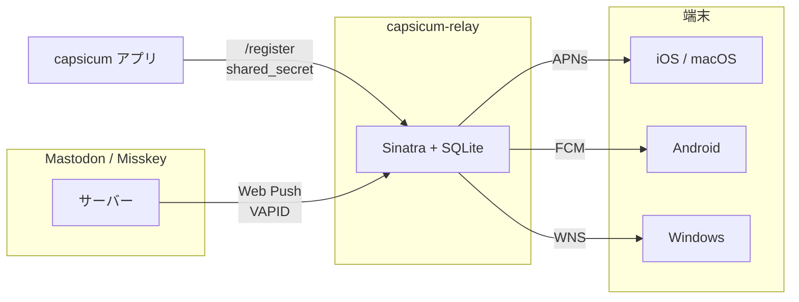
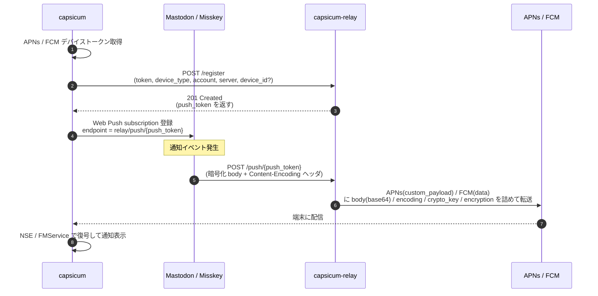
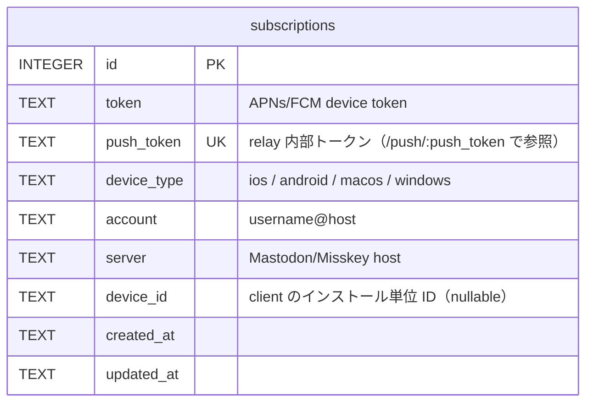

# capsicum-relay 開発ガイド

## プロジェクト概要

capsicum（Mastodon / Misskey クライアント）向けのプッシュ通知リレーサーバー。
Mastodon / Misskey が送出する Web Push を受信し、APNs（iOS / macOS）/ FCM（Android）/ WNS（Windows）に変換して転送する。

- **技術スタック**: Ruby / Sinatra / Puma / SQLite
- **稼働環境**: 本番 `relay.capsicum.shrieker.net` / ステージング `st.relay.capsicum.shrieker.net`（どちらも Ubuntu・systemd・nginx 背後の Puma）
- **リポジトリ**: <https://github.com/pooza/capsicum-relay>
- **本番稼働**: 2026-04（capsicum v1.18 と同時リリース）から。プリセットサーバーの利用者は無償、それ以外の利用者はアプリ内で買う利用権が要る（→ [entitlements.md](entitlements.md)）

### このリポジトリの docs

| ファイル | 中身 |
| --- | --- |
| **このファイル** | 構成・エンドポイント・データモデル・規約・ブランチとデプロイ・配送の運用 |
| [entitlements.md](entitlements.md) | 有償リレーの利用権（認可ゲート・プリセットの裏取り・レシート検証） |

⚠ **進捗と残作業は [GitHub Milestones](https://github.com/pooza/capsicum-relay/milestones) と Issue が正本**で、ここには写さない。マイルストーンは capsicum 本体と同名の枠で動く。

⚠⚠ **公開リポジトリなので、サーバーの内部情報（SSH の接続先・デプロイユーザー・ホスティングの構成）は書かない。**正本は運用側の非公開ドキュメント（chubo2 `docs/infra-servers.md` の capsicum-relay の節）。ここでは「ステージング」「本番」と呼ぶ。

## アーキテクチャ


```mermaid
flowchart LR
  subgraph sns[Mastodon / Misskey]
    srv[サーバー]
  end
  subgraph relay[capsicum-relay]
    app[Sinatra + SQLite]
  end
  subgraph device[端末]
    ios[iOS / macOS]
    android[Android]
    windows[Windows]
  end
  client[capsicum アプリ] -- /register<br/>shared_secret --> app
  srv -- Web Push<br/>VAPID --> app
  app -- APNs --> ios
  app -- FCM --> android
  app -- WNS --> windows
```

⚠ **Linux にはネイティブ push の経路が無い。**capsicum の Linux 版は起動中の WebSocket だけで通知を出すので、relay には登録されない。

- Web Push の暗号化ペイロードは復号**しない**。Base64 のまま `custom_payload` / `data` に詰め、クライアント側（iOS は NSE / Android は `FirebaseMessagingService`）で復号して表示する（B 案採用）。[capsicum#336](https://github.com/pooza/capsicum/issues/336) 参照
- リレーが秘密鍵を持たないことで、将来の外部ユーザー向け有償提供時も E2E 前提を維持できる

### エンドポイント

| メソッド | パス | 認証 | 用途 |
|---------|------|------|------|
| GET | `/health` | なし | ヘルスチェック。稼働中の `revision`（コミット）と購読数を返す |
| GET | `/metrics` | X-Relay-Secret | 配送・ゲート・検証の counter（⚠ in-memory で、再起動でゼロに戻る） |
| POST | `/register` | X-Relay-Secret | デバイストークン登録（capsicum → リレー） |
| DELETE | `/register/:id` | X-Relay-Secret | 登録解除 |
| POST | `/push/:push_token` | なし（トークンの推測困難性で保護） | Web Push 受信（Mastodon / Misskey → リレー） |
| POST | `/entitlements` | X-Relay-Secret | 有償リレーの利用権の発行（capsicum#597 / [#58](https://github.com/pooza/capsicum-relay/issues/58)） |
| GET | `/entitlements` | X-Relay-Secret + `X-Entitlement-Token` | 利用権の**現在の状態**を読む（⚠ 副作用なし・🔴 **token を URL に載せない**・[#80](https://github.com/pooza/capsicum-relay/issues/80)） |
| POST | `/store/apple/notifications` | なし（Apple の署名を検証） | App Store Server Notifications V2 の受け口（[#61](https://github.com/pooza/capsicum-relay/issues/61)） |
| POST | `/store/google/notifications` | なし（Pub/Sub の OIDC トークンを検証） | Google Play の Real-time developer notifications の受け口（[#62](https://github.com/pooza/capsicum-relay/issues/62)） |
| POST / DELETE / GET | `/announcement_subscriptions` | X-Relay-Secret | サーバーのお知らせ通知の購読（登録・解除・状態の読み出し） |
| POST / GET | `/supporters/tip` / `/supporters` | X-Relay-Secret | 投げ銭の記録と、サポーター状態の読み出し |

実装は `lib/relay/routes/` にルートごとのファイルで置いてある。

### 通信フロー


```mermaid
sequenceDiagram
  autonumber
  participant C as capsicum
  participant S as Mastodon / Misskey
  participant R as capsicum-relay
  participant P as APNs / FCM
  C->>C: APNs / FCM デバイストークン取得
  C->>R: POST /register<br/>(token, device_type, account, server, device_id?)
  R-->>C: 201 Created<br/>(push_token を返す)
  C->>S: Web Push subscription 登録<br/>endpoint = relay/push/{push_token}
  Note over S: 通知イベント発生
  S->>R: POST /push/{push_token}<br/>(暗号化 body + Content-Encoding ヘッダ)
  R->>P: APNs(custom_payload) / FCM(data)<br/>に body(base64) / encoding / crypto_key / encryption を詰めて転送
  P-->>C: 端末に配信
  C->>C: NSE / FMService で復号して通知表示
```

### ライフサイクル異常時の挙動

| 状況 | 応答 | 意図 |
|------|------|------|
| `/push/:push_token` で未知のトークン | 410 Gone | Mastodon 側の subscription を自動 destroy させる（404 だと残り続けるため） |
| APNs が `BadDeviceToken` / `Unregistered` / `DeviceTokenNotForTopic` を返した | 410 Gone + DB 行削除 | device token 無効化。Mastodon に cleanup を促しつつ relay 側も掃除 |
| FCM が `UNREGISTERED` / `SENDER_ID_MISMATCH` を返した | 同上 | 同上。`INVALID_ARGUMENT` は request 側バグでも出るため誤削除回避に含めない |

### APNs / FCM 転送ペイロードのスキーマ

`/push/:push_token` で受けた Web Push を APNs (`custom_payload`) / FCM (`data`) の同形フィールドに詰めて転送する。capsicum の NSE (iOS) / FirebaseMessagingService (Android) はこのスキーマに従って復号する。

| キー | 型 | 出現 | 内容 |
|------|-----|------|------|
| `body` | string (base64) | 常時 | Web Push の生 body（暗号化済）。`strict_encode64` で URL-safe でない通常の base64 |
| `encoding` | string | 常時 | `Content-Encoding` ヘッダ値（`aes128gcm` or `aesgcm`）。空文字なら非暗号化（通常はあり得ない） |
| `server` | string | 常時 | 登録時の `server`（Mastodon/Misskey ホスト名） |
| `account` | string | 常時 | 登録時の `account`（`username@host` 形式） |
| `crypto_key` | string | `aesgcm` のとき | `Crypto-Key` ヘッダ原文。`dh=...;p256ecdsa=...` などキー付きの値 |
| `encryption` | string | `aesgcm` のとき | `Encryption` ヘッダ原文。`salt=...` を含む |

#### 復号の実装上の注意

- **aes128gcm (RFC 8291)**: body 先頭に `salt` (16 byte) / `rs` (4 byte) / `idlen` (1 byte) / sender public key が前置されているため、body のみで復号可能。Mastodon 4.x / 現行 Misskey はこちら
- **aesgcm (legacy RFC 8188 draft 03)**: salt は `Encryption` ヘッダ、sender public key は `Crypto-Key` ヘッダの `dh=` パラメータに入っているため、これらも参照しないと復号できない。古い Mastodon フォーク / 一部 Misskey で使用される可能性あり
- **VAPID ヘッダ**: capsicum-relay は VAPID `Authorization` ヘッダを転送しない（push service 側で consume するもので、クライアント復号には不要）
- **TTL / Topic / Urgency**: Web Push 仕様のヘッダは転送しない（通知表示の用途なし）

## データモデル（SQLite）

`subscriptions` テーブルは `(token, account, server)` 複合ユニーク。同一端末に複数アカウントを登録した場合、各アカウントに独立した行と `push_token` が割り当てられる（1 デバイス N アカウント対応、[#3](https://github.com/pooza/capsicum-relay/issues/3) で実装）。


```mermaid
erDiagram
  subscriptions {
    INTEGER id PK
    TEXT token "APNs/FCM device token"
    TEXT push_token UK "relay 内部トークン（/push/:push_token で参照）"
    TEXT device_type "ios / android / macos / windows"
    TEXT account "username@host"
    TEXT server "Mastodon/Misskey host"
    TEXT device_id "client のインストール単位 ID（nullable）"
    TEXT created_at
    TEXT updated_at
  }
```

`UNIQUE(token, account, server)` + `UNIQUE(push_token)`。`push_token` は `SecureRandom.hex(32)`（64 文字 hex）。旧スキーマ（`UNIQUE(token)`）からの移行は起動時に自動で走る。

### device_id による dedup（[#15](https://github.com/pooza/capsicum-relay/issues/15)）

`UNIQUE(token, account, server)` だけだと、**デバイスの push トークンが更新されたとき衝突せずに新しい行ができ、旧行が孤児として残る**。旧トークンがまだ生きていて上流が両方に送る間は同一デバイスに二重 push が届き、時間とともに悪化する。

`(account, server, device_type)` に潰す案は採れない。実データに iPhone + iPad のように**全アカウントで 2 トークンを一貫保持して両方更新し続けている運用**があり、潰すと最後に登録した端末しか通知を受け取れなくなる。

そこで client が[インストール単位の安定 ID](https://github.com/pooza/capsicum/issues/932)（乱数 UUID・`shared_preferences` 保存）を `device_id` として送り、relay はそれをキーに upsert する。

- **列は nullable**。`device_id` を送らない旧クライアントは従来どおり `token` をキーに動く
- 実質的な `UNIQUE(account, server, device_id)` は**部分インデックス** `idx_subscriptions_device ... WHERE device_id IS NOT NULL` で張る（SQLite はテーブル制約に `WHERE` を書けない）
- 既存行は移行時に埋められないので `NULL` のまま。**次回 register で埋まる**のを待つ

`device_id` 付き register がどの行を上書きするかは順序に意味がある。

1. **今のトークンを持つ行**があればそれ。上流が現に push している行なので、`push_token` を保ったまま `device_id` を埋める。トークンを書き換えないので `UNIQUE(token, account, server)` に触れない。旧クライアントからの移行はここを通る
2. 無ければ**同じ `device_id` の行**。これがトークン更新のケースで、行を増やさず `token` だけ差し替える
3. どちらも無ければ新規 INSERT

1 と 2 が別の行を指すのは、トークンが一度離れて戻る場合だけで実運用では起きない。起きたときは部分インデックス違反になるため、古い方（2 の行）を畳んで 1 を残す。畳んだ行の `announcement_subscriptions` は FK の CASCADE で消える点に注意。

### 親テーブルを作り直す移行は、外部キーの参照名を壊す

CHECK 制約を変える（`device_type` に新しいプラットフォームを足す等）には、SQLite ではテーブルを rename して作り直すしかない。⚠⚠ **`PRAGMA foreign_keys=OFF` と `PRAGMA legacy_alter_table=ON` で囲わないと、rename した瞬間に SQLite が子テーブルの外部キーの参照先を `<親>_old` へ書き換える。**そのあと `<親>_old` を DROP すると参照が宙に浮き、`foreign_keys=ON` の下で子テーブルへの INSERT が毎回 `no such table: main.<親>_old` で落ちる（HTTP 500）。

- **実際に踏んだ**（2026-06-07）: `device_type` に `'macos'` を足すため `subscriptions` を作り直した結果、`announcement_subscriptions` の外部キーが壊れ、お知らせの購読が全プラットフォームで登録できなくなった
- ⚠ **`foreign_keys` はトランザクションの中では切り替えられない。**トランザクションの外で OFF / ON する
- ⚠⚠ **テストでは出にくい。**親の rename を含む移行が走ったあとに子テーブルへ INSERT して初めて落ちる。再現は in-memory の SQLite で「旧スキーマを作る → 移行を流す → 子テーブルへ INSERT」
- **直ったかの確認**: `PRAGMA foreign_key_check` と、子テーブルの `.schema` の参照先が `REFERENCES <親>`（`<親>_old` でない）こと
- 既に壊れた DB の修復は `Relay::Database#rebuild_subscriptions_table!` / `#repair_announcement_subscriptions_fk!`（スキーマ文字列に `_old` が残っていたら子テーブルを正しい外部キーで作り直す・何度流してもよい）

## 有償リレーの利用権

⚠ **別ファイルにある → [entitlements.md](entitlements.md)。**`entitlements` / `entitlement_tokens` のデータモデル・認可ゲート・プリセットの名乗りの裏取り（VAPID）・Apple / Google のレシート検証・観測の読み方はそちら。

⚠⚠ **`/register` と `/push` を触る回は先に読む。**どちらもゲートを通っており、「通す / 断る / 止める」の線は capsicum の [`docs/paid-relay-plan.md`](https://github.com/pooza/capsicum/blob/develop/docs/paid-relay-plan.md) が決めている。

## コーディング規約

### RuboCop

モロヘイヤ由来の `.rubocop.yml` を適用。`bundle exec rubocop` がクリーンであることを PR マージの最低条件とする。

### RuboCop に含まれない個人規約

以下はユーザーから都度指示される。指示があり次第ここに追記する。

- メソッド末尾でも `return` を省略しない（暗黙のreturnを使わない）。ただし初期化・マイグレーション等の「戻り値が意味を持たない副作用専用メソッド」は除く（モロヘイヤと同じ運用）
- インデントは常に2スペース。見栄えのための位置揃え（代入の右辺にcase/if式を置いて深くインデントする等）は使わない。`x = case ...` ではなく、各分岐内で個別に代入する
- Sinatra の `configure do` / `helpers do` はメソッド定義を束ねるブロックであり、行数で括らない。`Metrics/BlockLength` の `AllowedMethods` に追加してある
- Sinatra の route ブロック（`get '/xxx' do ... end`）の最終値は暗黙 return のままにする。`return` はブロック内でエンクロージングメソッドからの return になるため使わない。途中離脱は `halt` を使う

## テスト

**本リポジトリに CI は無い。**`bundle exec rake test` と `bundle exec rubocop` をローカルで通すことが唯一の担保になる。

### 配信の「配線」を足したら変異テストを回す

device_type やクライアントの対応を広げる変更（`AnnouncementWorker#deliver` の `case`、`PushHelpers#push_client_for` の分岐、payload 組み立ての分岐など）は、**足した行を消してもテストが 1 件も落ちない**形になりやすい。購読行はあるのに 1 通も届かず、例外にならないのでログにも出ないためで、[#36](https://github.com/pooza/capsicum-relay/issues/36) Phase 2 で実際に踏んだ（capsicum 側の同型は pooza/capsicum#919）。

- 配線を足したら、**その行を 1 つずつ壊してテストが落ちることを確認する**。落ちなければテストが配線を見ていない
- 「どのクライアントを渡すか」の決定を `deliver` の `case` と同じファイルに寄せ（`AnnouncementWorker.from_settings` がその形）、device_type ごとの導通テストを持たせる
- ⚠ 変異テストで `git checkout <file>` を使うと**未コミットの実装ごと巻き戻る**。壊す前にコミットしておくこと

### Ruby の作業は macOS 端末で行う

Windows 実機（capsicum の Windows 機能検証機）に Ruby を入れて `rake test` を回す案は採らない。**`Gemfile.lock` に Windows プラットフォームの行が載り、端末間で往復する**ため（capsicum の `pubspec.lock` ping-pong と同型）。Windows 側で relay の変更が必要になったときは、差分を Issue のコメントに置いて macOS 端末へ引き継ぐ。

## インフラ

⚠ **接続先・ユーザー・スペック・逐語のデプロイコマンドは運用側の非公開ドキュメントが正本**（chubo2 `docs/infra-servers.md` の capsicum-relay 本番 / ステージングの節）。ここにあるのは、コードを読むのに要る構成だけ。

| 項目 | 値 |
|------|-----|
| 公開ドメイン | 本番 `relay.capsicum.shrieker.net` / ステージング `st.relay.capsicum.shrieker.net` |
| OS | Ubuntu（LTS） |
| Ruby | rbenv 管理（版は `.ruby-version`） |
| プロセス管理 | systemd (`capsicum-relay.service`)。⚠ **unit の正本は chubo2 の cookbook**（`app/cookbooks/capsicum-relay/templates/capsicum-relay.service.erb`）。本リポジトリの `config/capsicum-relay.service.sample` はサンプルで、直しても実機には反映されない（#29） |
| リバースプロキシ | nginx（HTTPS 終端、Let's Encrypt 自動更新） |
| Puma | `127.0.0.1:9292`（nginx 背後） |

### ⚠⚠ ブランチ運用（2026-09-27 決定・[#68](https://github.com/pooza/capsicum-relay/issues/68)）

**ブランチ 2 本と環境 2 つを 1 対 1 に対応させる。**

| ブランチ | デプロイ先 | 保護 |
| --- | --- | --- |
| `develop` | **ステージング**（`st.relay.capsicum.shrieker.net`） | なし（直 push 可） |
| `main` | **本番**（`relay.capsicum.shrieker.net`） | ⚠⚠ **PR 必須 + `enforce_admins: true`** |

```text
feature（任意）→ develop → ステージングへデプロイして寝かせる
                    ↓ PR（⚠ ここで @codex review）
                  main → 本番へデプロイ
```

⚠⚠ **`main` へは直 push できない**（2026-09-27 に `enforce_admins: true` にした）。以前は保護が入っていても**管理者は素通りでき**、実際に [#58](https://github.com/pooza/capsicum-relay/issues/58)〜[#55](https://github.com/pooza/capsicum-relay/issues/55) の 5 回とも素通りで main へ入れてしまった。**規約では止まらなかったのでフックにした**（capsicum 側の `.claude/hooks/deny-shell-loops.sh` と同じ考え方）。

⚠ **急いでいても段取りは端折れない**（2026-09-27 pooza）。緊急時に本当に直 push が要るなら **`enforce_admins` を一時的に false にしてから**入れ、**戻す**。

```bash
gh api -X DELETE repos/pooza/capsicum-relay/branches/main/protection/enforce_admins  # 外す
gh api -X POST   repos/pooza/capsicum-relay/branches/main/protection/enforce_admins  # 戻す
```

⚠ **Codex は `@codex review` を打った時だけ走る。**追加コミットや force-push では発火しない。⚠ 未登録リポジトリや base SHA 取得不能で**空振りする**ことがあるので、空振りなら 5 観点レビュー（capsicum の `/release-review`）に切り替える。

### デプロイ手順

⚠ **ステージングを先に、本番を後に。**ホストごとに**見るブランチが違う**。接続先を埋めた逐語のコマンドは運用側の非公開ドキュメントにあり、下は形だけを示す。

⚠⚠ **`ssh` を 2 行並べてから共通のコマンドを書かない**（PR #70 の Codex P2）。最初の `ssh` がステージングのシェルを開いてしまい、**残りのコマンドがそちらで動く** ＝ **本番にしか当たらず、ステージングが未デプロイのまま「両方やった」ことになる。**ステージング先という手順そのものが壊れるので、**ホストごとに完結したブロックにする。**

⚠⚠ **リモート側も行頭に `cd` を書かない**（2026-10-05 に貼れなくなっていたのを直した）。capsicum の `.claude/hooks/deny-bare-cd-chain.sh` は**コマンド文字列の行頭 `cd` を見る**ので、ssh の引用符の中に書いた `cd` も拒否する（ローカルの cwd は動かないので誤検出だが、**回避する書き方を探さない**のが規約・capsicum#1198）。⚠ `git -C` と `(cd … && …)` で書けば通り、**リモートの cwd を残さない**ぶん下の「`ssh` を 2 行並べない」とも同じ向きになる。

```bash
# 1. ステージング（develop を追う）
ssh <ユーザー>@<ステージングのホスト> '
  git -C ~/repos/capsicum-relay pull &&
  (cd ~/repos/capsicum-relay && bundle install) &&
  sudo -n systemctl restart capsicum-relay
'
```

```bash
# 2. 本番（main を追う）。⚠ develop → main の PR をマージし、1 の疎通確認が通ってから
ssh <ユーザー>@<本番のホスト> '
  git -C ~/repos/capsicum-relay pull &&
  (cd ~/repos/capsicum-relay && bundle install) &&
  sudo -n systemctl restart capsicum-relay
'
```

⚠ **変更系（pull / restart）と確認系（status / log / curl）は同じ ssh セッションに混ぜない**（2026-05-28 に誤って本番を再起動した経緯がある）。

⚠ **restart 直後の `curl` は 502 を返す**（Puma が listen するまで 15〜20 秒）。下の「疎通確認」を参照。

### 疎通確認

```bash
curl https://relay.capsicum.shrieker.net/health
# => {"status":"ok","subscriptions":N}
```

⚠⚠ **restart の直後は 502 が返る。**Puma が listen するまで **15〜20 秒**かかる（起動ログの `Started capsicum-relay.service` から `Listening on http://127.0.0.1:9292` までの実測が 17 秒）。**3 秒後に curl して 502 を見て「起動に失敗した」と誤診しやすい。**

`journalctl -u capsicum-relay -n 20` に `Listening on` が出ているかを見るか、成功するまで待つ形にする:

```bash
for i in $(seq 1 20); do
  curl -sS -m 10 https://relay.capsicum.shrieker.net/health | grep -q '"status":"ok"' && break
  sleep 5
done
```

⚠ **ステージングと本番の `revision` を並べて見ると、デプロイの逆転が検出できる**（2026-09-13 に実際に検出した）。⚠ ステージングは購読が小さく `supporters` は 0 なので、数値が違っても異常ではない。

### ⚠⚠ 配送は非同期（[#55](https://github.com/pooza/capsicum-relay/issues/55)）

**受信して即 `202` を返し、送信はワーカーで行う。**設計と理由は `lib/relay/push_queue.rb` の doc が正本。

配送が同期だったので、**遅い 1 通が puma のスレッドを占有していた**（`workers 0` / `threads 2` ＝ 同時に 2 通・Windows は 1 通 2,056ms）。7 日の実測で **Windows が総処理時間の 88%** を占め、**利用者数ではなく Windows が relay の容量を決めていた**。

| env | 既定 | 何 |
| --- | --- | --- |
| `PUSH_QUEUE_CAPACITY` | 200 | 積める通数。⚠ **深くしない**（詰まりに気付かない時間と、再起動で失う通数が増える） |
| `PUSH_QUEUE_WORKERS` | 2 | 配送の並行数。⚠⚠ **`HttpConnectionPool::MAX_IDLE_PER_HOST` と揃える**（超えたぶんは checkin で閉じられ、[#54](https://github.com/pooza/capsicum-relay/issues/54) の接続再利用が効かなくなる） |

#### ⚠⚠ `gone` の削除は行 ID だけで判定しない

[update_registration] は **行 ID を保ったまま `token` を差し替える**（#15 の dedup のため）。配送をキューに積んでから結末が出るまでの間に `/register` で端末のトークンが更新されると、⚠⚠ **いま有効な登録を消してしまう**（`announcement_subscriptions` も CASCADE で落ち、上流は次の push で 410 を受けて購読を掃除する ＝ **利用者は再登録まで通知を失う**）。

→ `Database#unregister_stale(id, token)` で **積んだ時点のトークンと一致するときだけ**消す。⚠ 同期配送のときも同じ race があったが、窓がリクエストの中（〜2 秒）に限られていた。**#55 でキューの待ち時間ぶん窓が広がった**（PR #67 の Codex P1）。

#### ⚠⚠ 上流へ結末を返せなくなった、への答え

`202` を返した後に配送するので、`gone`（device token 無効）で **その場では 410 を返せない**。代わりに relay 側の行を落とし、**次の push が `410 Unknown push token` を返す**ことで上流の購読が掃除される。⚠ **1 通だけ「受け取ったのに届かない」通知が出る**のは承知の上のコスト。

#### ⚠ 再試行はしない（実測に基づく）

本番 30 日の `failed` 36 件は **android × FCM 400 が 25 件**（恒久的失敗）/ windows unknown 10 / no_response 1。⚠⚠ **再試行で救えるものがほぼ無い。**しかも同期のときは 502 を返して **Mastodon に 5 回 retry させていた** ＝ FCM 400 を 5 回投げ直していた。⚠ **APNs / FCM の 5xx が出るようになったら入れ直す**（30 日で 0 件）。

#### ⚠ 詰まりは `queued_ms` に出る

`latency_ms` は 1 通あたりの配送時間なので、**詰まっても変わらない**。`push.result` の `queued_ms`（キューで待った時間）と `relay_push_total{outcome="rejected"}` を見る。

#### ⚠⚠ 停止時に吐き切る

`config.ru` が `Relay::App.install_shutdown_hook!` を呼ぶ。⚠ **`configure` の中で `at_exit` を登録してはいけない** —— `minitest/autorun` より後に登録されるぶん**先に走り、テストが 1 件も動く前にキューが閉じる**。

⚠ 効いているのは `join`。**`SizedQueue#close` は積まれているものを捨てない**（`pop` は残りを返し切ってから nil・Ruby 4.0.6 で実測）。

### ⚠⚠ `/push` が返すステータスの選び方（[#66](https://github.com/pooza/capsicum-relay/issues/66)）

**ステータスは「上流が購読を消すか」で決まる。**配信結果を素直に写してはいけない。

| | 購読を消す条件 |
| --- | --- |
| **Mastodon** `Web::PushNotificationWorker#send` | ⚠ **`408` / `429` 以外の 4xx すべて** |
| **Misskey** `PushNotificationService` | ⚠⚠ **`410` だけ** |

#### 🔴 5xx を返したときの非対称（2026-09-28 に両者のソースで確認）

⚠⚠ **「5xx なら再送されるから通知は失われない」は Mastodon にしか当てはまらない。**

| | 5xx を受けたら |
| --- | --- |
| **Mastodon** `Web::PushNotificationWorker` | ✅ `sidekiq_options queue: 'push', retry: 5` —— **遅れるが失われない** |
| **Misskey** `PushNotificationService` | 🔴 **再送しない。**`.catch` は `err.statusCode === 410` しか見ず、⚠⚠ **それ以外は黙って捨てる**（ログも残らない） |

→ ⚠ **`503` で待たせる設計（`busy` など）は、Misskey 宛だと通知が消える。**
**弱いほうに合わせて、5xx は極力返さない**（[#78](https://github.com/pooza/capsicum-relay/issues/78) の先読みはこのため）。⚠ **ただし「5xx を避ける」を優先して失効した資格情報を通してはいけない** —— 期限切れの鍵は照合に使わない（PR #79 の締めの Codex P1）。

⚠ **[#55](https://github.com/pooza/capsicum-relay/issues/55) で配送が非同期になったので、ステータスは「受け取ったか」しか言えなくなった。**配送の結末はログと counter にだけ出る。

| 場面 | 返す | なぜ |
| --- | --- | --- |
| 受け取った | **202** | ⚠ 200 ではない —— 配送したかはまだ分からない |
| 知らない push_token | **410** | ⚠ **意図して消す**。上流の stale な購読を掃除させる |
| 利用権なし（[#60](https://github.com/pooza/capsicum-relay/issues/60)・既定は無効） | **410** | 同上 |
| 重複（dedup） | **200** | 4xx / 5xx だと retry や destroy を誘発する |
| クライアント未設定 | **503** | ⚠ **同期で返す。**202 に隠れると設定漏れに気付けない |
| キューが満杯 | **503** | ⚠ 黙って捨てない。⚠⚠ **4xx にしてはいけない**（購読が消える） |

⚠⚠ **意図して消したいときだけ 4xx（410）を返す。**#66 は `oversized` で 413 を返しており、「購読は健全なので残す」という**想定と正反対**に動いていた（Mastodon が destroy する）。⚠ **429 も選べない** —— destroy は免れるが `raise` になって sidekiq が retry し、**同じ oversized な payload は再送しても必ず失敗する**。

`test/push_outcome_status_test.rb` が結末とステータスの対応を固定している。

### 配信不達の切り分け（journald を読む）

「プッシュが届かない」を疑ったとき、**Sentry のイベント数だけで判定してはいけない**。本番の journald には成功も失敗も残っているので、必ず突き合わせる。

#### なぜ Sentry だけでは足りないか

- relay が Sentry へ上げているのは**失敗側だけ**。成功は journald と `/metrics` にしか出ないので、Sentry を見ると失敗だけが並び、母数が見えない
- WNS の `dropped` は**端末がオフライン / スリープで受け取れなかった**という正常系。PC を消している時間が長い利用者ほど積み上がるので、件数の多さは不具合の証拠にならない
- capsicum 側の `push.wns_bgtask: bgtask.shown` は、bg task が LocalState に書いた記録を**次回アプリ起動時に**回収して送る方式。**「出ていない ＝ トーストが出ていない」ではない**（アプリを起動していないだけ）

#### 手順

まず `/metrics` で母数と内訳を見る（#2）。14 日ぶんの journald を走査する前に、「そもそも relay に届いているか / 送れているか」がここで分かる。

```bash
curl -s -H "X-Relay-Secret: $SECRET" https://relay.capsicum.shrieker.net/metrics \
  | grep relay_push_total
```

`relay_push_total{device_type,outcome}` の `outcome` は `success` / `deduped` / `degraded` / `gone` / `oversized` / `failed` / `wns_<status>`。⚠ **counter はプロセス再起動でゼロに戻る**（in-memory）。再起動の位置は `/health` の `revision` の変化で分かる。

期間や個別アカウントを見るときは journald を読む。ログは **1 行 = 1 JSON**（#2）。

```bash
# 本番のホストで
journalctl -u capsicum-relay --no-pager --since "-14 days" -o cat \
  | grep '"event":"push.result"' \
  | jq -r '[.ts, .device_type, .outcome, .account] | @tsv'
```

⚠ **従来の grep もそのまま効く。** JSON の中に人間向けの `msg`（`Pushed to windows: <account>` / `WNS delivered but dropped: <account>`）を同じ文言で残してあるため。

```bash
journalctl -u capsicum-relay --no-pager --since "-14 days" -o short-iso \
  | grep -E "Pushed to windows:|WNS delivered but dropped:"
```

`outcome=success`（＝`Pushed to <device_type>:`）が成功、`outcome=wns_dropped`（＝`WNS delivered but dropped:`）が drop。アカウント別に数えて成功率を出し、さらに**時刻（JST）別の分布**を見る。

`request_id` は応答の `X-Request-Id` と同じ値で、Sentry イベントにも同名の tag が乗る。特定の 1 リクエストを追うときはこれで 3 者を突き合わせる。

#### 判定基準

| 観測 | 読み方 |
| --- | --- |
| 成功が特定の時間帯に集中し、それ以外は drop 一色 | **端末の電源パターン**。正常 |
| 全時間帯に成功が分散している | 常時通電の端末。正常 |
| 成功が 1 件も無い | ここで初めて端末側（bgtask 登録・チャンネル失効）を疑う |

成功率そのものは端末間で大きく開く（実測で 11%〜84%）が、**差の正体は「PC がついている時間の長さ」**であって端末の健全性ではない。低い成功率だけを見て不具合と判断しないこと。

journald は 2026-04-17（サービス開始時）から全期間残っている。経緯は [pooza/capsicum#931](https://github.com/pooza/capsicum/issues/931)。

#### お知らせ（announcement）が届かないとき

⚠ **通常の push とは別経路・別 counter**。上流から来た Web Push を中継する通常経路と違い、お知らせは worker が各サーバーを polling して自分で送る。`relay_push_total` には**乗らない**（#44）。

見分けたい 3 択は「① そもそも購読が無い」「② 送ったが失敗した」「③ 送って成功した」で、どれも journald だけで分かる。

```bash
# ① server ごとの fan-out。購読 0 件でも 1 行出る
journalctl -u capsicum-relay --no-pager -o cat \
  | grep '"event":"announcement.dispatch"' \
  | jq -r '[.ts, .server, .announcement_id, .subscriptions, (.device_types | tostring)] | @tsv'

# ②③ 配送 1 通ごとの結末
journalctl -u capsicum-relay --no-pager -o cat \
  | grep '"event":"announcement.push.result"' \
  | jq -r '[.ts, .device_type, .outcome, .account, .reason] | @tsv'
```

`/metrics` 側は `relay_announcement_push_total{device_type,outcome}`。`outcome` のラベル値は `relay_push_total` と揃えてあるので、「中継は成功しているのにお知らせ配信だけ落ちている」を並べて比較できる。お知らせ固有の値は次の 2 つ:

| outcome | 読み方 |
| --- | --- |
| `unconfigured` | その device_type の push クライアントが未設定（`reason=client_unset`）か、register が受け付ける種別に配送が追いついていない（`reason=unknown_device_type`）。**購読行はあるのに 1 通も届かない**状態で、設定漏れ・配線漏れを疑う |
| `no_result` | push クライアントが結果 Hash を返さなかった。実装の不整合 |

⚠ **失敗しても再送はされない。** `mark_announcement_seen` は server 単位なので、現状は「失敗した 1 通が失われたことが数字とログに残る」ところまで（#44 の C 案）。購読単位の再送は失敗率を見てから設計する。

### WNS の接続再利用を測る（[#54](https://github.com/pooza/capsicum-relay/issues/54)）

`push.result` の **`conn`** が、その 1 通で WNS への HTTP 接続を使い回せたかを表す（`reused` / `opened` / `reopened`。WNS 以外は出ない）。⚠ **`latency_ms` と同じ行にあるのが眼目** —— 接続確立にかかっていた 690ms が実際に消えているかは、この 2 つを並べないと分からない。

```bash
# conn ごとの件数と平均 latency（ヒット率と削減幅を同時に見る）
journalctl -u capsicum-relay --no-pager -o cat --since '-7 days' \
  | grep '"event":"push.result"' \
  | jq -r 'select(.device_type == "windows") | [.conn, .latency_ms] | @tsv' \
  | awk -F'\t' '{n[$1]++; s[$1]+=$2} END {for (k in n) printf "%s\t%d\t%.0fms\n", k, n[k], s[k]/n[k]}'
```

| conn | 読み方 |
| --- | --- |
| `opened` | プールが空だった（新規に TCP + TLS）。**push の間隔がアイドル上限 55 秒より長いとこれになる**ので、平常時はこちらが多い |
| `reused` | 使い回せた。⚠ **狙いはこれの平均 latency が `opened` より約 690ms 小さいこと** |
| `reopened` | 使い回した接続が相手に閉じられていて、張り直して送り直した（`WNS connection was stale` の warn が同時に出る）。⚠ **多発するならアイドル上限 (`IDLE_TIMEOUT`) が WNS 側の keep-alive より長い** |

⚠⚠ **`reused` が出ているのに latency が下がらない場合は `keep_alive_timeout` を疑う。**`Net::HTTP` の既定は 2 秒で、それを超えて空いた接続は **Net::HTTP 自身が黙って張り直す**。プールは「再利用した」と言い続けるので、**計測だけが嘘になる**（`Relay::HttpConnectionPool#configure` で上げてある）。

## ディレクトリ構成

```text
capsicum-relay/
  docs/
    CLAUDE.md          # 本ファイル
    entitlements.md    # 有償リレーの利用権
  app.rb               # ルートを束ねる Sinatra アプリ
  config.ru            # Rack エントリポイント（⚠ `run` の前にプリセットの鍵を温める）
  lib/relay/
    routes/            # エンドポイント（ルートごとに 1 ファイル）
    base_app.rb        # 全ルート共通の土台（認証・設定・ヘルパー）
    database.rb        # SQLite ラッパー（起動時の自動マイグレーション）
    # --- 配送
    apns_client.rb / apns_payload.rb   # APNs（iOS / macOS）と 4KB 超過時の degrade
    fcm_client.rb                      # FCM（Android）
    wns_client.rb / http_connection_pool.rb / serialized_connection.rb  # WNS（Windows）と接続の使い回し
    push_queue.rb / push_delivery_reporter.rb  # 非同期配送のキューと結末の記録
    push_helpers.rb / push_outcome.rb / push_dedup.rb  # 振り分け・結末とステータスの対応・重複排除
    announcement_worker.rb / announcement_delivery_reporter.rb  # サーバーのお知らせのポーリングと配送
    # --- 有償リレー（→ entitlements.md）
    entitlement_gate.rb / entitlement_helpers.rb / entitlement_observation.rb  # 認可ゲートと観測
    entitlement_reverifier.rb          # 利用権の定期的な再確認
    preset_servers.rb                  # プリセット判定（⚠ capsicum の preset_servers.dart の写し）
    vapid_assertion.rb / vapid_key_directory.rb / vapid_key_ledger.rb  # プリセットの名乗りの裏取り
    app_store_client.rb / apple_jws_verifier.rb / google_play_client.rb  # ストアのレシート検証
    store_verification.rb / store_errors.rb
    # --- 観測
    structured_log.rb / metrics.rb / sentry_setup.rb / revision.rb
  config/
    settings.yml.sample    # 設定ファイルテンプレート
    puma.rb                # Puma 設定
    capsicum-relay.service.sample # systemd ユニットの雛形（⚠ 稼働機の正本は運用側の cookbook・#29）
    nginx.conf.sample      # nginx 設定テンプレート
    apple_root_ca_g3.pem   # Apple の通知の署名検証に使うルート証明書
  db/                  # SQLite データベース格納先
  test/                # minitest（⚠ CI は無い。ローカルで通すのが唯一の担保）
```

## 設定

`config/settings.yml.sample` をコピーして `config/settings.yml` を作成する。
クレデンシャルは `.gitignore` で除外されている。⚠ **各キーの意味と罠はサンプルのコメントが正本**で、下は「何が要るか」の一覧。

### 設定ファイルの節

| 節 | 用途 | 無いとき |
|------|------|--------|
| `shared_secret` | capsicum からの登録認証（`X-Relay-Secret`） | ⚠⚠ **起動はするが、認証付きのエンドポイントが守られない**（必ず書く） |
| `apns`（`.p8`・Key ID・Team ID・Bundle ID） | iOS / macOS への送信 | APNs 宛が送れない |
| `fcm`（プロジェクト ID・サービスアカウント JSON） | Android への送信 | FCM 宛が送れない |
| `wns`（Package SID・client secret） | Windows への送信 | Windows 宛の push は 503 |
| `app_store`（アプリ内課金キー・`environments`） | Apple の購入の検証 | 検証しない（購入は `unverified` のまま・通知の受け口は 503） |
| `google_play`（relay 専用のサービスアカウント・Pub/Sub の照合値） | Google の購入の検証 | 同上 |
| `relay_audience` | プリセットの名乗りを裏取りするときの VAPID の `aud` | ⚠⚠ **裏取りができず、プリセットを名乗る push がすべて通る**（必ず書く） |
| `extra_preset_hosts` | プリセット判定に**足す**ホスト（任意） | 既定の一覧だけで判定する |
| `announcement.poll_interval` | お知らせのポーリング間隔（0 で止める） | — |

### 環境変数

| 変数 | 用途 |
|------|------|
| `RELAY_ENTITLEMENT_ENFORCE` | `true` のときだけ認可ゲートが拒否する（→ [entitlements.md](entitlements.md)）。⚠ 設定ファイルではなく環境変数で切り替える |
| `PUSH_QUEUE_WORKERS` / `PUSH_QUEUE_CAPACITY` | 非同期配送のワーカー数とキューの長さ |
| `PUSH_DEDUP_WINDOW_MS` | 同じ push の重複排除の窓 |
| `PUMA_THREADS` | Puma のスレッド数 |
| `SENTRY_DSN` | 失敗側の記録の送り先（無ければ送らない） |
| `RELAY_CONFIG_PATH` / `RELAY_DB_PATH` | 設定ファイルと DB の場所（テストと複数環境の切り分け用） |

## 関連リポジトリ

| リポジトリ | 関係 |
|-----------|------|
| [capsicum](https://github.com/pooza/capsicum) | クライアント本体。リレーにデバイストークンを登録し、通知を受信する |
| [mulukhiya-toot-proxy](https://github.com/pooza/mulukhiya-toot-proxy) | モロヘイヤ。Ruby の運用知見・コーディング規約の共有元 |

