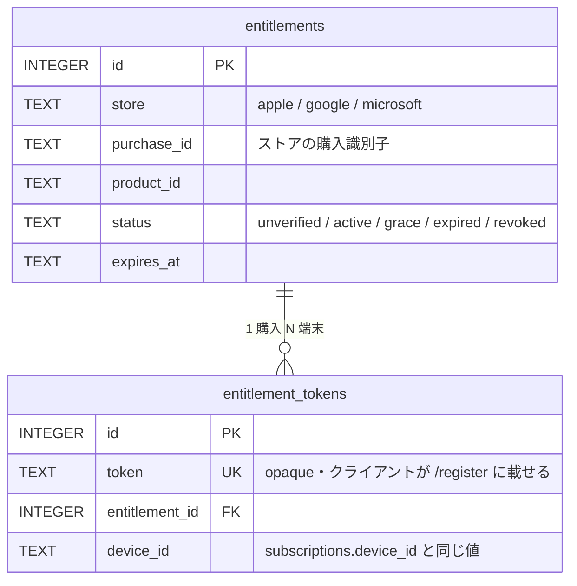

# 有償リレーの利用権

[capsicum#597](https://github.com/pooza/capsicum/issues/597)（外部ユーザー向け有償プッシュ通知リレー）の relay 側。**誰がリレーを使えるかを決めるのは relay で、クライアントは判定しない。**

- 設計と判断の正本は capsicum の [`docs/paid-relay-plan.md`](https://github.com/pooza/capsicum/blob/develop/docs/paid-relay-plan.md)。ここには relay の実装に固有のことだけを書く
- [開発ガイド](CLAUDE.md) から分けた（2026-10-06・[#73](https://github.com/pooza/capsicum-relay/issues/73)）。開発ガイドが 1 回で読めない大きさになっていたため。⚠ **利用権・ゲート・レシート検証の話はこのファイルへ足す**

## いまの状態

**フェーズ 1〜3 は実装済みで、本番はゲートを有効にして動いている**（2026-10-04〜）。

| フェーズ | 中身 | Issue |
| --- | --- | --- |
| 1 | 利用権トークンの発行と記録（観測のみ） | [#58](https://github.com/pooza/capsicum-relay/issues/58) / [#59](https://github.com/pooza/capsicum-relay/issues/59) |
| 2 | `/register` と `/push` の認可ゲート・プリセットの名乗りの裏取り | [#60](https://github.com/pooza/capsicum-relay/issues/60) / [#69](https://github.com/pooza/capsicum-relay/issues/69) |
| 3 | Apple / Google のレシート検証・サブスク状態の追随 | [#61](https://github.com/pooza/capsicum-relay/issues/61) / [#62](https://github.com/pooza/capsicum-relay/issues/62) / [#63](https://github.com/pooza/capsicum-relay/issues/63) |

- **ゲートは環境変数 `RELAY_ENTITLEMENT_ENFORCE` が `true` のときだけ拒否する。**それ以外は判定だけして通す（`enforce_off`）。⚠ 「実装が入っている」と「拒否している」は別なので、挙動を読むときは稼働機の設定を確かめる
- **プリセットサーバーのアカウントを 1 つでも持つ端末は、非プリセットのアカウントも含めて全部通す。**これは意図した仕様で、穴ではない
- ⚠ **ゲートは fail-open。**判定そのものが例外で落ちたときは通す（`reason="error"`）。壊れていても誰も止まらないので、**監視するのはこの `reason="error"`**
- 残っている検証（返金・猶予・課金リトライの一巡など）は [#63](https://github.com/pooza/capsicum-relay/issues/63) が正本

## データと判定



### ⚠⚠ `unverified` を許可側に入れない

`POST /entitlements` の認証は共有シークレット 1 本で、**そのシークレットはバイナリから取り出せる**（[capsicum#1121](https://github.com/pooza/capsicum/issues/1121)）。つまりこのエンドポイントは実質的に開いており、**誰でも好きな `purchase_id` で `unverified` の行を作れる**。フェーズ 3 でレシートを検証して初めて `active` になる。

#### ⚠ 状態を読む口は `POST` と分ける（[#80](https://github.com/pooza/capsicum-relay/issues/80)）

`GET /entitlements`（`X-Entitlement-Token` ヘッダ）は**手元の token のいまの状態**を返す。

🔴 **token を URL に載せない。**`config/nginx.conf.sample` は素の `access_log` を有効にしており、**リクエスト行に完全なパスが残る** —— ⚠⚠ **token はそのまま利用権として使える capability** なので、平文でログに溜まる。⚠ **ヘッダは既定のログ書式に含まれない。**

⚠⚠ **`POST /entitlements` を状態確認に使い回さない。**あちらは upsert なので冪等ではあるが、呼ぶたびに `relay_entitlement_token_total` が増え `entitlement.issued` が出る —— **「発行の回数」を数えている counter が「画面を開いた回数」に汚染され、ゲートを閉じてよいかの判断材料が濁る。**

- ⚠ **副作用を持たない。**metrics もログも増やさない（テストで固定してある）
- ⚠ **ストアへ問い合わせ直さない。**状態を書くのは通知（Apple V2 / Play RTDN）と再確認の仕事で、ここは DB を読むだけ

#### 🔴🔴 `request.env` のヘッダ文字列は `ASCII-8BIT`（2026-09-28 実測）

**Puma / Rack がヘッダから作る String はバイナリ**で、⚠⚠ **そのまま SQLite にバインドすると TEXT ではなく BLOB になる。**`WHERE token = ?` は TEXT と BLOB を比べることになり、**行があっても永久に一致しない。**

```ruby
# 🔴 引けない（BLOB として比較される）
settings.database.find_entitlement_token(request.env['HTTP_X_ENTITLEMENT_TOKEN'])

# ✅ UTF-8 へ直してから渡す
value = raw.dup.force_encoding(Encoding::UTF_8)
```

⚠ **`request.env` から読むときだけの話。**`params`（URL 由来）と `json_body`（`JSON.parse` 由来）は UTF-8 なので起きない。

⚠⚠ **気づきにくい理由が 2 つある。**

1. **`authenticate!` は壊れない。**`X-Relay-Secret` は**文字列比較**なので encoding が違っても ASCII 同士なら `==` が true。**認証は通り、SQL へ渡す値だけが壊れる**
2. 🔴🔴 **Rack::Test では再現しない。**env に**素の String（UTF-8）**を入れるので、**壊れた実装でも検査が緑になる** —— 実際にそう書いて、**1 件も引けない実装のまま検査だけ通っていた**。⚠ **ヘッダを読む route の検査は `force_encoding(Encoding::BINARY)` で渡す**

#### 🔴 認証が要る応答はキャッシュさせない（[#81](https://github.com/pooza/capsicum-relay/pull/81) の Codex P2）

`authenticate!` が `Cache-Control: private, no-store` を付ける。

⚠⚠ **`GET /entitlements` で実際に穴になっていた。**区別する値（`X-Entitlement-Token`）が**カスタムヘッダにしか無い**ので、**キャッシュ鍵は全員同じ** —— ブラウザ / CDN / 前段のプロキシが**最初の呼び出し元の token と購入 ID を別人へ返しうる。**

- ⚠ **`authenticate!` に置く理由は「入口を 1 本にする」。**route ごとに足すと、**認証付きの GET を増やしたときに付け忘れる**（`/metrics` も `/supporters` も同じ形で、鍵は全員同じ）
- ⚠ **`Vary` では足りない** —— 知らない `Vary` を無視するキャッシュがある
- ⚠ **`/health` には付かない**（無認証・秘密を返さない）

⚠⚠ **ヘッダで capability を受ける口を足したら、`Relay::SentrySetup::SENSITIVE_HEADERS` にも足す。**例外が上がると Rack 統合がリクエストごと捕まえるので、入れ忘れると**丸ごと Sentry へ出る。**
- ⚠⚠ **404 と「失効」を混ぜない。**クライアントから見て「知らない token」（端末の保存が壊れた / 消された）と「失効した token」（解約・支払い失敗）は**別の状況**で、案内が違う

### ⚠ 判定は `subscriptions.device_id` から引く

```text
/push/{push_token} → subscriptions（push_token UNIQUE）
                   → subscriptions.device_id
                   → entitlement_tokens（device_id）
                   → entitlements.status
```

クライアントが `/register` に載せてくる `entitlement_token` は**観測のため**に記録するだけで、判定には使わない。⚠ **`device_id` が NULL の行（旧クライアント）は利用権を引けない。**

### ⚠ `subscriptions` に列を足さない

あのテーブルは CHECK / UNIQUE を変えるたびに `rebuild_subscriptions_table!` が要り、**その組み替えは過去に子テーブルの FK を壊している**（`repair_announcement_subscriptions_fk!` が今も居座っているのがその跡・[capsicum#468](https://github.com/pooza/capsicum/issues/468)）。**課金の都合で push の中核テーブルを組み替えない。**

### ⚠ `status` に CHECK を付けない

[#63](https://github.com/pooza/capsicum-relay/issues/63) で扱う状態（更新・失効・返金・支払い猶予・課金リトライ）は**これから増える**。CHECK にすると状態を 1 つ足すたびにテーブル組み替えになり、`subscriptions` で踏んだ罠を新しいテーブルで再現する。検査は `Relay::Database::ENTITLEMENT_STATUSES` で行う。

### プリセット判定の写し

`lib/relay/preset_servers.rb` は capsicum の `packages/capsicum/lib/src/preset_servers.dart` の**写し**。⚠⚠ **2 箇所に同じ一覧がある。**

- ⚠ **クライアントに判定させられない。**ゲートは「非プリセット かつ 利用権なし」で閉じるので、申告に委ねると書き換えるだけで抜けられる
- ⚠⚠ **ズレると、載っていないプリセットサーバーの利用者がフェーズ 3 で止まる。**`test/preset_servers_test.rb` が件数を固定しているので、片方だけ増やすとテストが落ちる
- 設定の `extra_preset_hosts` は**足すことしかできない**（置き換えにすると、設定を書き忘れたデプロイで全登録が非プリセット扱いになる）

### 認可ゲート（[#60](https://github.com/pooza/capsicum-relay/issues/60)・フェーズ 2）

⚠⚠ **既定では何も閉じない。**`RELAY_ENTITLEMENT_ENFORCE=true` を立てたときだけ判定する。**本番で立てるのはフェーズ 3 の決定**で、⚠ **立てる前に下の観測を読み直すこと**。

判定は `Relay::EntitlementGate.decide` の 1 か所で、`/register` と `/push` の両方が通る。⚠ **2 か所に書くと片方だけ閉じる**（登録は拒むのに既存の購読は叩き続ける）。

| 順 | 条件 | 結果 |
| --- | --- | --- |
| 1 | `RELAY_ENTITLEMENT_ENFORCE` が `true` でない | allow（`enforce_off`） |
| 2 | プリセットホストで、**名乗りの裏が取れた** | allow（`preset`） |
| 2' | プリセットホストだが**鍵が引けなかった** | ⚠⚠ allow（`preset_unverifiable`）＝ fail-open |
| 2'' | プリセットホストだが**署名が無い / 鍵が違う** | ⚠ **プリセット扱いをやめて 3 へ**（2''' は通らない） |
| 2''' | **非プリセット**の行だが、**同じ `device_id` にプリセットを名乗る購読がある**（[#82](https://github.com/pooza/capsicum-relay/issues/82)） | allow（`preset_device`） |
| 3 | その端末に `active` / `grace` の利用権がある | allow（`entitled`） |
| 4 | それ以外 | **deny**（`no_entitlement` / `preset_unsigned` / `preset_mismatch`） |
| — | 判定中に例外 | ⚠⚠ **allow**（`error`）＝ fail-open |

⚠⚠ **2''' は仕様そのもの**（「プリセットに 1 アカウント持てば全部無償」・設計書 1-2）。**穴として塞がない。**クライアントは `server` に**そのアカウント自身のホスト**を送るので、行の `server` だけで決めると**併用者の外部サーバー側が止まる** —— しかもその人の画面には課金の表示が出ない（capsicum#1123）ので**黙って通知が消える**。⚠ **名乗りは申告のまま認める**（2026-10-03 pooza 判断）。VAPID の裏取りを条件にすると、プリセットのアカウントにほとんど通知が来ない人が外部の通知を失う。⚠ `device_id` の無い行（旧クライアント）には効かない。

#### ログアウトしたあとも 2''' が効き続ける件は、塞がない（[#84](https://github.com/pooza/capsicum-relay/issues/84)・2026-10-09 pooza 決定）

capsicum は**ログアウトでは relay の購読行を消さない**（消えるのは端末トークンの入れ替え・端末まるごとの畳み込みのときだけ）。そのため、**一度でもプリセットサーバーにログインした端末は、ログアウト後も 2''' で通り続ける** ＝ 利用権の購入が要らなくなる。

**これは塞がない。**

- 害は「取りはぐれ」だけで、誰かの通知が止まる話ではない。収益の目標は「relay を持ち出しにしないこと」（設計書 6）なので、取りはぐれの許容度は高い
- ⚠⚠ **塞ぐ側の案は、どれも「届かなくする」危険を持つ。**行の鮮度や直近の `/push` で母数を絞ると、プリセットと外部を併用していて**プリセット側が静かな人**の外部の通知が止まる（#82 で直したものへ戻る）。**「プリセットの利用者に課金しない」という不変条件を崩すほうが重い**
- client 側でログアウト時に行を消す案は、打ち漏らし（アプリの削除・オフライン・失敗）が残るので、これだけでは閉じない。**足す理由が別に出たときに考える**

⚠ **再判定しない。**対象者が増えて取りはぐれが「relay を持ち出しにしない」目標に届かなくなったときだけ、数字を持って開け直す。

### プリセットの名乗りの裏取り（[#69](https://github.com/pooza/capsicum-relay/issues/69)）

⚠⚠ **`subscriptions.server` はクライアントの申告で、それ自体は証拠にならない。**共有シークレットは authorization boundary にできない（[capsicum#1121](https://github.com/pooza/capsicum/issues/1121)）ので、**誰でも `server: "mstdn.b-shock.org"` と名乗れる。**

→ **`/push` を叩くのは fedi サーバー自身**なので、**VAPID の署名だけは本物かどうかを確かめられる**。

```text
Authorization: vapid t=<JWT(ES256)>,k=<公開鍵>      ← 標準（RFC 8292）
Authorization: WebPush <JWT>  +  Crypto-Key: …;p256ecdsa=<公開鍵>   ← ⚠ 旧形式
                 ↓ 署名を検証（Relay::VapidAssertion）
                 ↓ そのホストの鍵と突き合わせる（Relay::VapidKeyDirectory）
```

- **鍵の取得元**（2026-09-28 に 9 ホストで実測）: Mastodon は `GET /api/v2/instance` の `configuration.vapid.public_key`、Misskey は `POST /api/meta` の `swPublickey`
- ⚠⚠ **引くのは一覧のホストだけ。**申告をそのまま取りに行くと **relay が SSRF の道具になる**
- ⚠⚠ **`aud`（宛先）まで見る。**鍵の照合だけでは足りない —— 攻撃者が**プリセットサーバーで自分のサーバー宛ての購読を作れば、本物の鍵で署名された `Authorization` を受け取れる**ので、それを期限内に貼り直せば通ってしまう
- 🔴 **期待値は設定（`relay_audience`）からしか取らない。リクエストのヘッダから組まない。**Rack の `request.host` は **`X-Forwarded-Host` を見る**うえ、`config/nginx.conf.sample` はそのヘッダを**消していない**。組んでいた版では、攻撃者が自分宛ての本物の署名に `X-Forwarded-Host` を添えるだけで**期待値ごと攻撃者の値になり、照合が素通りした**。⚠ **未設定なら「判定できない」に倒す**（`outcome="audience_unconfigured"` で fail-open）—— 勝手に組んで「検査したつもり」になるほうが危ない。⚠⚠ **デプロイ時に settings.yml へ書くこと**
- ⚠⚠ **鍵が合わなかったら、詐称と決める前に 1 度だけ引き直す。**プリセットサーバーが VAPID を作り直すと TTL のあいだ手元は古い鍵のままで、**本物の push が全部 mismatch になり、閉じていれば 410 で上流の購読が永久に消える**。⚠ 引き直しは **60 秒に 1 回まで**（合わない鍵で叩き続けるだけで DoS の踏み台になる）。⚠ **引き直せなかったら fail-open**
- ⚠⚠ **`exp` を「在ること」から要求する。**`JWT.decode` の期限検査は **claim が在るときだけ効く**ので、`exp` の無い assertion は**永久に貼り直せる**（`required_claims: ['exp']`）。⚠ **数値であることまで見る** —— 2026-09-28 に jwt 3.2.0 で実測したところ、**文字列の `exp`（`"9999999999"`）はそのまま素通りした。**上限は 24 時間（RFC 8292 §2）。⚠⚠ **ただし上限を素で当てない** —— **Mastodon は `exp` をちょうど 24 時間後に置く**（`PAYLOAD_EXPIRATION = 24.hours`）ので常に上限ぴったりで、**相手の時計がこちらより進んでいるだけで本物が全部落ちて 410 になる。**5 分の余裕を持たせる（`EXPIRY_SKEW`）
- ⚠⚠ **引いてきた値は、P-256 の公開鍵として読めるまで覚えない。**空でない壊れた値（サーバーの設定ミス・直列化の事故）をそのまま覚えると、**本物の署名がその値と永久に一致しない** —— 引き直しの間隔が明けるたびに同じ壊れた値が返るので mismatch が繰り返され、**閉じていれば 410 で購読が消える。**⚠ **長さと先頭バイト（65 バイト・`0x04`）だけでは足りない**（曲線上に無い点が通る）ので `OpenSSL` に読ませて判定する（`Relay::VapidAssertion.public_key?`）。読めなければ **nil ＝「引けなかった」**へ倒す
- ⚠ **503 の `Retry-After` を固定値にしない。**`busy` には由来が 2 つあり、**明けるまでの長さが 1 桁違う** —— 枠の取り合いは引き終わるまで（5 秒）、引き直しの間隔（`MIN_REFRESH_INTERVAL`）は ⚠ **最大 60 秒**。後者に「1 秒後に」と答えると、**上流は明けるまで 503 を受け続けて再試行の枠を使い切る**（通知が遅れる / 落ちる）。残りを `Relay::VapidKeyLedger#retry_after` に訊く
- ⚠⚠ **受け付ける前にプリセットの鍵を温めておく**（[#78](https://github.com/pooza/capsicum-relay/issues/78)・`config.ru` の `run` の**前**で `warm!`）。冷えたまま push が同時に来ると、枠を取れなかったぶんが `busy`（503）になる —— 2026-09-28 の本番投入直後に **3 通中 2 通**で実測した。🔴 **Misskey は 5xx を再送しない**（上の「5xx を返したときの非対称」）ので**通知が消える**。⚠ **背景へ投げっぱなしにしない** —— 温めている最中の push が `busy` になる（warm が唯一の枠を握るうえ、まだ温まっていないホストには手元の鍵も無い）。⚠ **9 ホスト直列の実測は 488ms** なので待ってよい。⚠⚠ **ただし上限つき**（`WARM_BUDGET`）—— ホストが落ちていると 1 台で最大 12 秒かかり、**待っている間は nginx が 502** で🔴 Misskey 宛はやはり落ちる。**どちらも失うなら短いほうを選ぶ。**⚠ **`configure` の中でやらない** —— テストが実サーバーへ本当に HTTP を投げる
- ⚠ **温まり具合は `relay_vapid_keys_fresh` / `relay_vapid_keys_hosts` で見る**（[#78](https://github.com/pooza/capsicum-relay/issues/78)）。⚠⚠ **`relay_vapid_verification_total` では代わりにならない** —— push が来るまで 1 件も出ないので、**先読みの空振りにも TTL 切れにも気付けない**。⚠ **数えるのは期限内の鍵だけ**（PR #79 の Codex P2）—— 期限切れを混ぜると**手元の鍵は残る**ぶん数字が**永久に満室のまま**になり「冷えている」が読めない。⚠⚠ **`fresh` が `hosts` を下回っている ＝ そのホスト宛の push は `busy` になり得る**
- 🔴 **期限切れの鍵を照合に使わない**（PR #79 の締めの Codex P1）。⚠⚠ **鍵が漏れてローテーションされた場合**、期限切れの鍵を「枠が取れなかったから」という理由で使うと、**攻撃者は別のホストで枠を占有し続けるだけで、捨てたはずの鍵を無期限に通せる**（`classify_preset_claim` は一致した時点で `verified` にして引き直さないので、「合わなければ引き直す」では守れない）。⚠ **`busy`（503）を返すほうを選ぶ** —— 🔴 Misskey は 5xx を再送しないので通知は落ちるが、**失効した資格情報が通り続けるほうが重い。**冷えた窓は先読みで消してある
- ⚠⚠ **1 回温めるだけでは足りない**（PR #79 の Codex P1）。起動時に全ホストを**ほぼ同時**に覚えるので、**TTL（6 時間）後に 9 個が一斉に期限切れになり、冷えたバーストがそのまま戻る** —— ⚠ **長く動いているプロセスほど確実に踏む**。`WARM_REFRESH_INTERVAL`（1 時間）で引き直し続ける。⚠ **`join` で待たない** —— 繰り返すぶんスレッドは終わらないので、`join(budget)` だと**毎回 budget を丸ごと待つ**（実際に踏んだ）。待つのは「1 巡目が終わったか」だけ
- ⚠ **先読みは 1 ホストずつ rescue する**（PR #79 の Codex P2）。ループ全体を囲うと、**1 台の妙な応答で以降のホストが全部冷えたまま**になる
- 🔴 **サーバーの応答に `Hash#dig` を直に使わない。**`{"configuration":"unexpected"}` のような**形は正しいが中身が違う** JSON で `String does not have #dig method` が飛ぶ。⚠⚠ **`public_key_for` は route から呼ばれていて例外を捕まえていないので、`/push` が 500 になる**（2026-09-28 に実測）。途中が Hash でなければ nil にする（`dig_in`）
- ⚠ **metrics のラベルは正規化した host。**`subscriptions.server` は生の申告なので、大小・末尾のドット・空白の変種の数だけ系列が増える
- ⚠⚠ **旧形式（`WebPush` + `Crypto-Key`）を落とさない。**Mastodon は `standard` が false の購読へ旧形式で送るので、落とすと**本物のプリセットが詐称扱いになる**
- ⚠ **「鍵が引けない」と「署名が無い / 違う」を同じ倒し方にしない。**前者は**こちらの障害**なので fail-open、後者は**プリセット扱いをやめる**。署名が無いのを fail-open にすると、**ヘッダを付けないだけで迂回できる**＝直したことにならない
- ⚠ **`/register` では検証しない**（叩くのはクライアント自身で署名が存在しない）。**止めるのは `/push`** なので穴は残らない
- ⚠ **`enforce` の有無に関わらず検証を走らせる**（`relay_vapid_verification_total`）。**閉じてから測ると止めてから気付く**

⚠⚠ **`RELAY_ENTITLEMENT_ENFORCE` を立てる前に `relay_vapid_verification_total` を読む。**`verification="verified"` が `/push` のプリセット分をほぼ全部占めていることが条件。`unavailable` が多いなら**こちらが鍵を引けていない**（閉じても fail-open で素通りする）。

⚠ **穴を塞いだのではない。**「プリセットに 1 アカウント持てば全部無償」は**完全に意図通り**で残す（capsicum `docs/paid-relay-plan.md` 1-2 / 未決事項 3）。塞ぐのは「**アカウントを作らずにプリセットを名乗れる**」ほうだけ。

拒んだときの応答:

| route | status | 理由 |
| --- | --- | --- |
| `/register` | **403** `{"reason":"entitlement_required"}` | ⚠ 401（シークレット違い）と区別できる形にする |
| `/push` | **410 Gone** | ⚠⚠ Mastodon / Misskey が購読を掃除する。黙って 200 を返すと**失効後も永久に叩かれる** |

⚠ **`/register` は登録してから判定する。**行を作らずに拒むと、ゲートを閉じた瞬間に「誰が止まったか」が DB から分からなくなる（#59 の観測の母数が消える）。配送は `/push` で止まるので、行が残っていても通知は出ない。

⚠ **`/push` が 410 を返しても `subscriptions` の行は消さない。**購入が復活したらクライアントの再登録で同じ行（同じ `push_token`）が使われる。消すと `announcement_subscriptions` も CASCADE で消える。⚠ **復帰には再登録が要る**（capsicum#1123 の導線）。

#### ⚠⚠⚠ #69 が未解決のままゲートを閉じてはいけない

**プリセット判定が `subscription['server']` を見ているが、これは `/register` がクライアントから受け取ってそのまま保存した値で、検証していない。**共有シークレットは authorization boundary にできない（[capsicum#1121](https://github.com/pooza/capsicum/issues/1121)）ので、⚠⚠ **誰でも `server: "mstdn.b-shock.org"` と名乗って `push_token` を得て、それを自分のサーバーの Web Push 宛先に渡せばゲートを迂回できる。**

⚠ 設計書 決定済み事項 3 が受け入れたコストは「プリセットサーバーにアカウントを 1 つ作る」で、⚠⚠ **実際は「サーバー名を打つだけ」**。**受け入れたリスクより広い。**

→ [#69](https://github.com/pooza/capsicum-relay/issues/69) でサーバー側から検証できる assertion（VAPID 公開鍵の pin が有力）を用意してから閉じる。

#### ⚠⚠ `unverified` を許可側に入れない

`POST /entitlements` は共有シークレットしか見ておらず、**そのシークレットはバイナリから取り出せる**（capsicum#1121）。**誰でも `unverified` の行を作れる**ので、入れるとゲートが無意味になる。`test/entitlement_gate_test.rb` が固定している。

#### ⚠⚠ 410 で購読が消えることは実測済み（2026-09-27）

設計書は「410 が正しい」と書いていたが**実測していなかった**。ステージングで踏んで確定させた。

**フォークのソース**（推測で語らないための一次情報）:

| | 購読を消す条件 |
| --- | --- |
| **Mastodon** (`Web::PushNotificationWorker#send`) | ⚠ **`408` / `429` 以外の 4xx すべて** |
| **Misskey** (`PushNotificationService`) | ⚠⚠ **`410` だけ**。403 / 404 では消さず**永久に叩き続ける** |

→ **両方に効くのは 410 だけ**なので、ゲートの拒否は 410 で返す。

**ステージングでの実測**（st2.mstdn.b-shock.org = dev24 → st.relay）:

1. 既存の購読に触らず、**relay が知らない push_token を指す購読を 1 件作った**
2. `Web::PushNotificationWorker` を同期実行 → nginx のアクセスログに `POST /push/… 410`
3. **購読が destroy された**（既存 2 件は無傷）

⚠ **st2.misskey.delmulin.com → st.relay の push は直近 7 日で 0 件**（購読行はあるが通知が発生していない）。**Misskey 側のライブ確認は未了**でソース読みのみ。

#### ⚠ `reason="error"` が 0 でないあいだゲートは効いていない

fail-open なので拒まれず、**metrics を見ないと気付けない**。`entitlement.gate` のログは **warn** で出る。

```console
$ curl -s -H "X-Relay-Secret: $SECRET" https://relay.capsicum.shrieker.net/metrics \
    | grep relay_entitlement_gate_total
```

### Apple の購入の検証（[#61](https://github.com/pooza/capsicum-relay/issues/61)・フェーズ 3）

**入口は 2 つ**で、判断は `Relay::AppStoreVerification.verify!` の 1 か所にある。

| 入口 | いつ | 何を引く |
| --- | --- | --- |
| `POST /entitlements`（`store: apple`） | クライアントが購入を送ってきた | `purchase_id`（StoreKit の transactionId） |
| `POST /store/apple/notifications` | Apple の Server Notifications V2 | 通知の `signedTransactionInfo` の元の取引 ID |

⚠⚠ **状態は常に App Store Server API（`GET /inApps/v1/subscriptions/{id}`）から引き直す。**クライアントの申告も通知の中身も「どの購入か」を知るためにだけ使う（Apple は通知の順序を保証せず、再送もする）。

| 決まりごと | 理由 |
| --- | --- |
| ⚠⚠ **`purchase_id` を元の取引 ID へ付け替える** | transactionId は更新のたびに変わる。付け替え先が既にあれば端末の token を寄せて元の行を消す（同じ端末なら元の token を返す） |
| ⚠⚠ **fail-open** | Apple に届かない・5xx・401 のときは**状態を変えない**。新規は `unverified` のまま。通知は **503 を返して Apple に再送させる** |
| **通知の署名** | `x5c` の葉 → 中間 → **同梱の Apple Root CA - G3**（`config/apple_root_ca_g3.pem`・指紋はテストで固定）。⚠ `x5c` に入っているルートは使わない。通知の受け口は**共有シークレットを見ない**ので、ここが唯一の関門 |
| **環境** | 本番は Production → Sandbox の順に引く（**TestFlight の購入は Sandbox**）。ステージングは Sandbox だけ。`entitlements.environment` に印を付ける |
| ⚠ **TestFlight のテスターは身内だけ**（2026-09-27 pooza） | 本番でもサンドボックスの購入を有効に扱うため。外部テスターを開くなら `environment=Sandbox` を拒否側へ |
| `billing_retry` | Apple が支払いを再試行している間。**拒否側**（ゲートの許可は `active` / `grace` だけ） |
| ⚠ **確かめ直しのワーカー**（`EntitlementReverifier`） | 登録時に Apple へ届かず transactionId のまま `unverified` で残った購入は、**更新の後の通知ではどちらの ID でも引けない**。10 分おきに確かめ直して元の取引 ID へ付け替える。⚠ `unverified` は誰でも作れるので **1 回 20 件・作られてから 7 日以内**に縛る。`app_store.reverify_interval`（秒・0 で止める） |
| ⚠⚠ **古い結果で上書きしない**（`entitlements.signed_at`） | Apple が応答に署名した時刻（`signedDate`）を保存し、**それより古い結果では状態を書かない**。同じ購入でも付け替え前の行は別の行 ID を持つので、**鍵だけでは防げない**（別々の端末が別の取引 ID で送ってくる）。行の付け替え自体は時刻に関係なく行う |
| ⚠ **購入ごとの鍵** | 「Apple から読む → 書く」を同じ行については 1 本ずつ（上の時刻の比較と二重の守り）。⚠ **全体で 1 本の鍵にしない**（Apple が遅いと puma の 2 スレッドが両方待たされ、push の受け付けまで止まる） |
| ⚠ **接続の直列化**（`SerializedConnection`） | SQLite の接続は puma のスレッド間で共有で、トランザクションは接続単位。**トランザクションの間はほかのスレッドの SQL を待たせる**（混ざると他人の巻き戻しに巻き込まれて消える） |

- 鍵は**アプリ内課金キー**（`app_store.key_path`）。⚠ **期限は無い**。revoke されると 401 → error ログ + `relay_entitlement_verify_total{outcome="unavailable"}`
- ⚠ **`outcome="unavailable"` が続くなら検証が止まっている**（fail-open なので状態は変わらず、metrics を見ないと気付けない）
- 通知の URL は App Store Connect の「App Store Server Notifications」。⚠ **本番 URL は relay、サンドボックス URL は st.relay**

### Google の購入の検証（[#62](https://github.com/pooza/capsicum-relay/issues/62)・フェーズ 3）

Apple と**同じ判断**（`Relay::StoreVerification`）に乗る。ストアごとの違いはクライアント（`purchase_status`）に閉じる。

| 入口 | 何を引く |
| --- | --- |
| `POST /entitlements`（`store: google`） | `purchase_id`（purchaseToken） |
| `POST /store/google/notifications`（Pub/Sub の push） | 通知の `subscriptionNotification` / `voidedPurchaseNotification` の purchaseToken |

| 決まりごと | 理由 |
| --- | --- |
| **purchaseToken がそのまま購入の識別子** | Apple と違い、更新で変わらない。再購入・プラン変更は新しい token（`linkedPurchaseToken`）で、クライアントが送り直す |
| ⚠⚠ **通知の認証は OIDC** | Pub/Sub は共有シークレットを付けられない。**宛先（`push_audience`）と送り手（`push_service_account`）の両方**を照合する。Google の公開鍵が取れないときは 503（再送させる） |
| ⚠ **`CANCELED` は期限までは `active`** | 自動更新を止めただけ。`ON_HOLD` は `billing_retry`（拒否）、`IN_GRACE_PERIOD` は `grace`（許可）、`PENDING` は `pending`（拒否・#62 で足した） |
| **順序（`signed_at`）** | Google の応答は署名時刻を持たないので、**問い合わせを始めた時刻**を使う |
| **ライセンステスター** | `testPurchase` があれば `environment=Sandbox`。⚠ TestFlight と同じく本番でも有効・**テスターは身内だけ** |
| 投げ銭（消耗型）の通知 | `oneTimeProductNotification` は利用権と関係ないので 200 で受け流す |
| ⚠ **Pub/Sub は 1 トピックに購読を複数付けられる** | 本番とステージングの両方へ届けられる（Apple は環境ごとに URL が 1 つ） |
| ⚠ **Proc を `set` しない** | Sinatra は Proc の設定を読み出しのたびに呼ぶ。OIDC の検証器は `call` を持つモジュール（`GooglePlayClient::OidcVerifier`） |

### ストアが「知らない」と言い続ける購入（[#63](https://github.com/pooza/capsicum-relay/issues/63)）

⚠⚠ **`not_found` は行を触らない**（ストアの応答で状態を上書きしない fail-open の一種）。そのため **何もしなければ終端にも落ちず、掃除の除外条件にも入らない** —— `stale_entitlements` は `expires_at` が NULL / 過去なら**毎周引く**ので、`touch_entitlement` では止まらない。

🔴 **2026-10-05 にステージングで実測: 行 3 つに対して `not_found` が 694 回**（`sweep="unverified"` 416 / `sweep="stale"` 278）。**ストアが知らない購入へ 10 分ごとに永久に API を叩いていた**うえ、⚠⚠ **その行はゲートを fail-open で通り続ける**（期限の読めない `active` は通す側）＝ **無期限に無償で通る行**が残る。

| 連続した `not_found` | 扱い |
| --- | --- |
| `NOT_FOUND_GRACE_CHECKS`（3）回まで | **従来どおり毎周引く。**⚠⚠ **買った直後の伝播待ちを待たせないため** —— その行は `unverified` でゲートが deny し、**自動で治す経路はこの掃除だけ**（クライアントは起動時に `POST /entitlements` を送り直さず、持っている token で `GET` するだけ）。既定の 600 秒間隔なら約 30 分ぶん |
| それ以降 | `NOT_FOUND_BACKOFF_DAYS`（1 日）に 1 回へ落とす |
| `NOT_FOUND_TERMINAL_DAYS`（7 日）続いたら | **`revoked` へ落とす**（終端なので `stale_entitlements` の除外に入り、掃除が止まる） |

⚠ **終端にするかは「回数」ではなく `not_found_since`（いつから続いているか）で決める** —— 掃除の間隔を変えても判断が動かないようにするため。

⚠⚠ **連続が始まった `unverified` の行は、作成の窓（`WINDOW_DAYS`・7 日）を過ぎても引き続き引く**（PR #86 の Codex P2）。`not_found_since` が立つのは最初の掃除（作成 + 数分）なので、**作成基準の窓は終端（同じ 7 日）より必ず先に閉じる** ＝ 窓だけで切ると **約束した `revoked` に永久に到達しない。**⚠ **叩く量は増えない** —— バックオフで 1 日 1 回に落ち、7 日で終端になって `status` の条件から外れる ＝ **1 行あたり 10 回前後で打ち止め**（直す前は 7 日間 10 分ごと ＝ 1,000 回超）。

⚠⚠ **バックオフの時計は `not_found_checked_at`。`updated_at` で測ってはいけない**（PR #86 の Codex P2）。あれは `POST /entitlements` の upsert でも若返るので、🔴 **purchase_id を知っている者が前景で叩き続けるだけで終端に永久に到達しない**（＝ `active` で期限が読めない行が無期限に通る）。⚠ 共有シークレットはバイナリから取り出せる前提なので**到達可能な経路**。

⚠⚠ **数えるのは購入ごとの鍵の中**（`StoreVerification.verify!`・同じ Codex P2）。鍵の外で数えると、同じ購入の**成功した検証と競合して通ったばかりの行に連続を書き戻す**（7 日に達していれば `revoked` まで行く ＝ **正当な購読者が次の明示的な検証まで拒否される**）。⚠ **前景（`POST /entitlements` / 通知）でも同じ数えが進む**ので、定数は掃除のワーカーではなく `Relay::Database` 側に置いてある。

⚠ **スレッド 2 本の競合テストでは守れない。**鍵を解いた直後に数える実装でも成功側より先に書き終わるため**素通りする**（2026-10-05 に穴を開けて確認）。**鍵を握っているかを直接見る**テストにしてある（`LockWatchingDatabase`）。

⚠⚠ **「購入はあるが、利用権の商品ではない」（`product_mismatch`）は `not_found` と分ける**（[#93](https://github.com/pooza/capsicum-relay/issues/93)）。以前は同じ `not_found` に数えていたので、**`product_ids` の設定を誤ると、正当な購入が全部「知らない」に倒れ、連続が終端の日数に達すると `revoked` まで進んだ**。metrics（`relay_entitlement_verify_total` の `outcome`）からも、でたらめな `purchase_id` と区別できなかった。⚠ **終端へは進めない**（設定を直せば、次の検証で戻れる）が、**確かめ直しの間隔（バックオフ）は効かせる** —— 効かせないと掃除がその行を毎回引き続ける。ログは `entitlement.product_mismatch`。

⚠⚠ **不一致の回は、終端までの時計（`not_found_since`）を動かさず、戻す**（PR #94 の Codex P2）。連続の回数と最後に確かめた時刻だけを進める（バックオフが見るのはこの 2 つ）。時計まで進めると、**不一致が 7 日続いたあとに本物の `not_found` が 1 回来ただけで、数え直さずに即 `revoked` になる** ＝「終端へ数えない」が間接的に破れる。ストアはその購入を知っているので、それまでの「知らない」の連続もここで切れたものとして扱う。⚠ 副作用: 作成から 7 日を過ぎた `unverified` の行は、時計が無いので掃除の対象から外れる。設定を直したあとは、アプリからの次の検証（前景）で戻る。

⚠⚠ **「届かない」（`unavailable`）では数えない。**ストア障害で有効な購読を失効させてはいけないので、あちらは順番の後ろへ回すだけ（`invalid` も同じ）。⚠ ストアが答えたら `not_found_streak` / `not_found_since` は 0 / NULL に戻る（`update_entitlement_verification!`・**書けたときだけ** —— 古い結果が順序で弾かれた回に数えを消すと終端までの日数が延びる）。

⚠ 買い直したときは**クライアント自身の `POST /entitlements`** がその場で確かめるので、終端にしても回復経路は残る。

### 観測（[#59](https://github.com/pooza/capsicum-relay/issues/59)）

`relay_register_entitlement_total{preset,entitlement,token}` が、フェーズ 3 でゲートを閉じたときに誰が止まるかを先に示す。

```console
$ curl -s -H "X-Relay-Secret: $SECRET" https://relay.capsicum.shrieker.net/metrics \
    | grep relay_register_entitlement_total
```

- `preset="no"` かつ `entitlement="none"` … **止まる候補**
- `preset="device"` … 行は非プリセットだが**同じ端末にプリセットの購読がある**。⚠ **ゲートは通す**（[#82](https://github.com/pooza/capsicum-relay/issues/82)）ので止まる候補に**数えない**
- `token="mismatch"` … ⚠ **token を送れているのに止まる**いちばん分かりにくい形（別の端末の token を持っている）
- `token="unknown"` … relay が知らない token（別の relay 向け・手で作った値・DB を戻した後）

